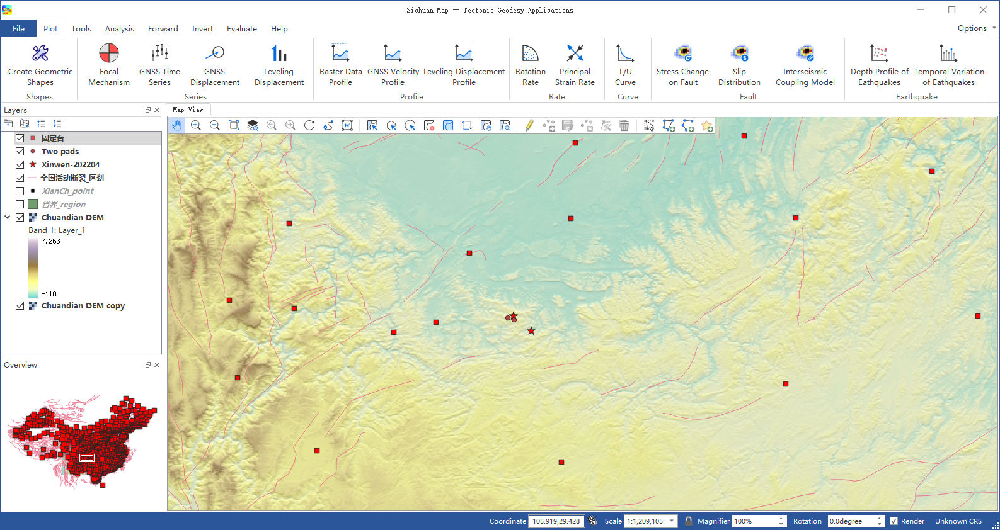

================================
 1 Getting Started (软件介绍)
================================

1.1 Overview (概述)
------------------------

构造大地测量软件（Tectonic Geodesy Applications, TGA）为64位应用程序，其前身为2009年开发的32位活动断层地震危险性评估系统。该32位软件集绘图、数据分析、格林函数计算和大地测量反演为一体，其中绘图功能基于美国ESRI公司的ArcObjects组件开发实现。在2016年前该软件称为活动断层地震危险性评估系统，随着功能的不断增加和完善，软件现更名为构造大地测量应用软件。

目前32位软件已获得国家发明专利和软件著作权登记各一项（软件著作权登记号：2010SR056240；发明专利号：ZL 2016 1 0975859.3），并在期刊测绘学报上发表了该软件系统的主要功能（2012，41（5），661-669）。但是，由于ArcObjects只支持32位运行模式，导致软件的反演和模型分析能力受到制约。为此，自2018年开始基于开源的QGIS软件研发64位版本。

这套软件主要面向地震、科研院所和高校等系统中从事大地测量、地质和地球物理等方面工作的专业人员，目前软件主要功能包括：

(1) 实现基础 GIS数据浏览功能，包括栅格和矢量数据浏览、渲染，属性表查看，支持多种地图投影。
(2) 数据兼容：提供广泛的数据格式支持，包括常用GIS数据，以及GIS中很少用到但构造大地测量工作者非常熟悉的GMT数据格式。
(3) 快速成图：实现活动断层、形变场、主应变率、块体旋转率、震源机制解和地震目录数据的快速绘制，提供制图过程必需的地图符号，提供比例尺、图例、指北针等必需的布局元素、
(4) 绘图准确：绘图过程中的数据处理结果准确，符号标注、图例、比例尺、坐标注记的信息正确无误。
(5) 可以指定格式输出：在地图制作完成后，可以将结果输出为矢量格式或指定分辨率的栅格格式。

1.2 Data Files (数据格式)
------------------------------------

1.2.1 地图工程文件
~~~~~~~~~~~~~~~~~~

软件使用QGIS标准的.qgz与.qgs作为地图工程文件格式，类似 ArcGIS的.mxd文件，工程文件记录 了 一个工程所引用的图层、渲染样式及其他用 QGIS开发接口实现的配置信息。.qgz是二进制格式 ，.qgs则是 XML格式的文本文件，可以在普通的文本编辑器中直接进行编辑。

1.2.2 GDAL栅格数据
~~~~~~~~~~~~~~~~~~

软件使用QGIS封装的GDAL/OGR库进行GIS数据的独写。考虑到构造大地测量制图领域常用的数据格式，软件实现了对4种标准GDAL栅格格式的支持，如表2.1所示。其中，GTiff与HFA是GIS中最常用的两种栅格影像存储格式；STRMHGT是NASA航天飞机雷达地形任务（Shttle Radar Topographic Mission, SRTM）的DEM产品格式，该产品覆盖全球80%以上，由USGS免费分发；由于GDAL驱动的限制，软件对GMT NetCDF文件支持有体积上限，为2GB。

.. list-table:: 表2.1 软件支持的栅格地理空间数据格式
   :widths: 20 15 40
   :header-rows: 1

   * - GDAL代码
     - 后缀
     - 说明
   * - GTiff
     - tiff
     - 可以带有空间参考的TIF格式
   * - HFA
     - img
     - 常用于卫星影像数据
   * - SRTMHGT
     - hgt
     - SRTM高程数据
   * - GMT
     - grd
     - GMT常用的NetCDF网格文件

1.2.3 OGR矢量格式
~~~~~~~~~~~~~~~~~~

考虑到构造大地测量制图领域常用的数据格式，软件实现了对4种标准OGR矢量格式的支持，如表2.2所示。其中，ESRI shapefile是美国环境系统研究所公司（ESRI）开发的空间数据开放格式，该文件格式也是地理信息软件界的开放标准；GMT指的是GMT5新定义的OGR兼容格式，包含空间信息 、属性信息和元数据（包括版本号、空间投影等，使其可以被其他GIS软件调用，该格式的详细介绍可以参见 https://docs.gmt-china.org/latest/table/ogr/，非OGR兼容格式的旧版本GMT格式见1.2.4节；GeoJSON是近年来开始流行的地理空间数据格式，相比ESRI Shapefile，GeoJSON格式的数据更为简洁，并且是JSON格式的纯文本，更具可读性。

.. list-table:: 表2.2 软件支持的矢量地理空间数据格式
   :widths: 20 15 40
   :header-rows: 1

   * - OGR代码
     - 后缀
     - 说明
   * - ESRI Shapefile
     - shp
     - 应用最广泛的矢量GIS格式
   * - KML
     - kml 
     - Google Earth默认格式，基于XML
   * - GMT
     - gmt
     - GMT默认ASCII矢量格式       
   * - GeoJSON
     - geojson
     - 轻量级矢量格式，基于JSON

1.2.4 站点数据格式
~~~~~~~~~~~~~~~~~~

站点数据结构包括点位的站号、别名、经度与纬度，文件后缀为.nll，格式请参考 `站点数据格式.nll <https://github.com/wanghai1988/qtgahelp/blob/main/files/%E7%AB%99%E7%82%B9%E6%95%B0%E6%8D%AE%E6%A0%BC%E5%BC%8F%E7%A4%BA%E4%BE%8B.nll>`_ ，下面是一个简单的示例。

.. code-block:: go

     Name1  Name2  Long(deg)  Lat(deg)                                                 
       0      0     100.735    31.304 
       1      1     100.825    31.229  
       2      2     101.130    31.100  
       3      3     101.201    30.988  
       4      4     101.113    30.962   
       5      5     101.169    30.938

1.2.5 GNSS形变数据格式
~~~~~~~~~~~~~~~~~~

GNSS形变场（或速度场）的数据结构包括站点名、经度、纬度、高程、东方向形变、北方向形变、高程形变、东方向误差、北方向误差、高程误差、误差相关系数、以及站点的观测时间。文件后缀为 .gps格式，示例格式请参考 `GNSS形变数据格式.gps <https://github.com/wanghai1988/qtgahelp/blob/main/files/GNSS%E5%BD%A2%E5%8F%98%E6%A0%BC%E5%BC%8F%E7%A4%BA%E4%BE%8B.gps>`_。时间格式为年 -月 -日，下面是一个简单的示例 。

.. code-block:: go

 Site          Long(deg)      Lat(deg)       H(m)    DisE(cm)  DisN(cm)  DisH(cm)  SigE(cm) SigN(cm) SigH(cm)   Corr       Datetime
 BESI        84.38000000    28.22900000      0.000     0.170    -0.090     1.360    0.300    0.220    1.080   -0.0150     2017-08-26
 BNDP        84.39510000    27.94950000      0.000     0.160    -0.050     0.320    0.300    0.230    0.770    0.0460     2017-08-26
 CHLM        85.31410000    28.20720000      0.000    -0.130    -1.970     0.290    0.170    0.160    0.490   -0.0280     2017-08-26
 CHWN        84.38540000    27.66830000      0.000     0.040    -0.040     0.550    0.240    0.250    0.810    0.0300     2017-08-26
 DMAU        84.26500000    27.97300000      0.000     0.370    -0.050     0.750    0.250    0.220    0.740    0.0330     2017-08-26

1.2.6 水准形变场格式
~~~~~~~~~~~~~~~~~~~~

水准形变场数据格式包括站点名、坐标、垂向形变、形变精度与观测时间。文件后缀为 .lev，格式请参考 `水准形变数据输入格式.txt <https://github.com/wanghai1988/qtgahelp/blob/main/files/%E6%B0%B4%E5%87%86%E5%BD%A2%E5%8F%98%E6%95%B0%E6%8D%AE%E8%BE%93%E5%85%A5%E6%A0%BC%E5%BC%8F.txt>`_   。形变量与精度的单位不做要求，时间格式为年 -月 -日，下面是一个简单的示例。

.. code-block:: go

    Site	Long	Lat	H	DisH	SigH	Date
    SITEA	96.153	33.795	11.866	-2.632	1.00	2019-01-01
    SITEB	96.154	33.770	12.481	-2.711	1.00	2019-01-02
    SITEC	96.155	33.746	13.140	-2.794	1.00	2019-01-03
    SITED	96.156	33.722	13.845	-2.884	1.00	2019-01-04
    SITED	96.157	33.697	14.601	-2.982	1.00	2019-01-05

1.2.7 主应变率格式
~~~~~~~~~~~~~~~~~~

主应变率数据格式包括格网点的经纬度、最大应变率、最大应变率中误差、最小应变率、最小应变率其误差、最小应变率中误差、方位角以及方位角中误差，文件后缀为 .psr，格式请参考 `主应变率数据输入格式.txt <https://github.com/wanghai1988/qtgahelp/blob/main/files/%E4%B8%BB%E5%BA%94%E5%8F%98%E7%8E%87%E6%95%B0%E6%8D%AE%E8%BE%93%E5%85%A5%E6%A0%BC%E5%BC%8F.txt>`_ 。方位角以北方向为起始方向，逆时针旋转，单位为角度。主应变率场通常由格网生成，因此软件没有规定各个点位的站点名字段，下面是一个简单的示例。

.. code-block:: go

    Long	Lat	E1	Sig1	E2	Sig2	Azi	SigA
    73.000	21.000	3.118	0.000	-9.059	0.00	60.50	0
    73.000	22.000	3.572	0.000	-6.299	0.00	53.26	0
    73.000	23.000	5.739	0.000	-4.942	0.00	312.89	0
    73.000	24.000	9.100	0.000	-5.377	0.00	307.55	0
    73.000	25.000	12.257	0.000	-7.185	0.00	307.44	0

1.2.8 旋转率场格式
~~~~~~~~~~~~~~~~~~

旋转率场数据格式包括网格点的经纬度、旋转率值域旋转率中误差，文件后缀为 .ror，格式请参考 `旋转率数据输入格式.txt <https://github.com/wanghai1988/qtgahelp/blob/main/files/%E6%97%8B%E8%BD%AC%E7%8E%87%E6%95%B0%E6%8D%AE%E8%BE%93%E5%85%A5%E6%A0%BC%E5%BC%8F.txt>`_ 。旋转角以北方向为起始方向，逆时针旋转，单位不做要求。同主应变率类似，旋转率数据也不必规定点位的站点名，下面是一个简单的示例。

.. code-block:: go

    Long	Lat	R	Sig
    73.000	21.000	60.50	0
    73.000	22.000	53.26	0
    73.000	23.000	312.89	0
    73.000	24.000	307.55	0
    73.000	25.000	307.44	0

1.2.9 震源机制解格式
~~~~~~~~~~~~~~~~~~~~

震源机制解数据格式包括地震名称、震中坐标与深度、地震矩震级、两个P波初动节面的走向角、倾角和滑动角，以及发震的日期和时间，文件后缀为 .fms，格式请参考 `震源机制解数据输入格式.txt <https://github.com/wanghai1988/qtgahelp/blob/main/files/%E9%9C%87%E6%BA%90%E6%9C%BA%E5%88%B6%E8%A7%A3%E6%95%B0%E6%8D%AE%E8%BE%93%E5%85%A5%E6%A0%BC%E5%BC%8F.txt>`_ ，下面是一个简单的示例。

.. code-block:: go

    Name	Long	Lat	Depth	Mw	Str1	Dip1	Rake1	Str2	Dip2	Rake2	Date		Time
    GCMT	104.42	32.63	15	6.7	29	48	122	166	51	60	1976-08-16	14:06:55
    GCMT	104.29	32.37	15.3	6.3	198	40	113	349	54	72	1976-08-21	21:49:58
    GCMT	104.21	32.11	19.6	6.4	172	45	72	16	48	107	1976-08-23	03:30:12

1.2.10 旧版本GMT线数据
~~~~~~~~~~~~~~~~~~~~~~~~
旧版本GMT线数据是设计过程中需要考虑的兼容格式，其格式请参考 `GMT线数据格式.txt <https://github.com/wanghai1988/qtgahelp/blob/main/files/GMT%E7%BA%BF%E6%95%B0%E6%8D%AE%E6%A0%BC%E5%BC%8F.txt>`_ 。线数据使用 2种后缀，分别为 .lin与.plg。前者加载后识别为线要素；后者加载后识别为面要素，若每段线首尾坐标不一致，自动将其闭合。面要素可以使用填充符号，还可以在数据提取时作为范围模板要素，下面是一个简单的示例。

.. code-block:: go

    >
    142.65	53.23
    141.57	52.58
    141.03	52.27
    140.43	51.81
    139.76	51.52
    139.57	51.47
    >
    136.85	50.54
    135.71	50.06
    134.89	49.86
    134.09	49.68
    131.36	47.99

  
1.2.11 InSAR 二进制文件
~~~~~~~~~~~~~~~~~~~~~~~~

GAMMA等 SAR软件处理获取的地面形变信息以二进制形式存储。要将形变信息在地图上显示，需要将其转换为软件支持的栅格格式。二进制文件不包含任何范围、分辨率等信息，因此在使用时需要搭配记录了必要信息的头文件。二进制数据后缀为 .bin，头文件后缀为 .rsc。头文件记录了二进制数据起始点（左上角像元）的经纬度、最大灰度值、最小灰度值、经向步长、纬向步长、像元行数、像元列数以及像元格式。像元格式包括16位整形、 32位浮点型或 64位浮点型3种，分别使用“ int16”、 float”、“double”标记。输入格式请参考 `栅格头文件输入格式.txt <https://github.com/wanghai1988/qtgahelp/blob/main/files/%E6%A0%85%E6%A0%BC%E5%A4%B4%E6%96%87%E4%BB%B6%E8%BE%93%E5%85%A5%E6%A0%BC%E5%BC%8F.txt>`_ ，下面是一个简单的示例。

.. code-block:: go

    ROW		5400
    COLUMN		4950
    TOPLEFT_X	103.000
    X_STEP		0.000277777777777778
    TOPLEFT_Y	33.900
    Y_STEP		-0.000277777777777778
    DATA_FORMAT	float

1.3 Coordinate Systems (坐标系统)
------------------------------------

软件使用的地理坐标系统（Geographic Coordinate System）为World Geodetic System 1984（简称WGS84）,其EPSG编码为4326。软件使用的投影坐标系统（Projected Coordinate System）为高斯克吕格投影（Gauss-Kruger projection）。在加载数据时，如果数据本身带有坐标系统，软件会采用动态投影自动转换至当前坐标系统下。

1.4 Installation (软件安装)
------------------------------------------------------------------------
:download:`QTGA下载 <https://github.com/wanghai1988/QTGA/releases/download/v0.1/QTGA.zip>`.

1.5 Runtime Environment (运行环境)
------------------------------------------------------------------------

(1) 操作系统：软件目前支持Windows 7/10/11 64位操作系统
(2) 依赖环境：软件目前运行需依赖 MATLAB R2020a，因此需要安装MATLAB R2020a软件或安装R2020a版本对应的MATLAB Runtime（下载地址：https://ww2.mathworks.cn/products/compiler/matlab-runtime.html）
