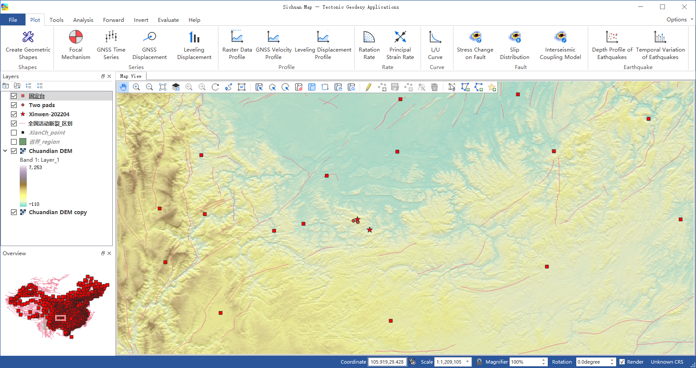
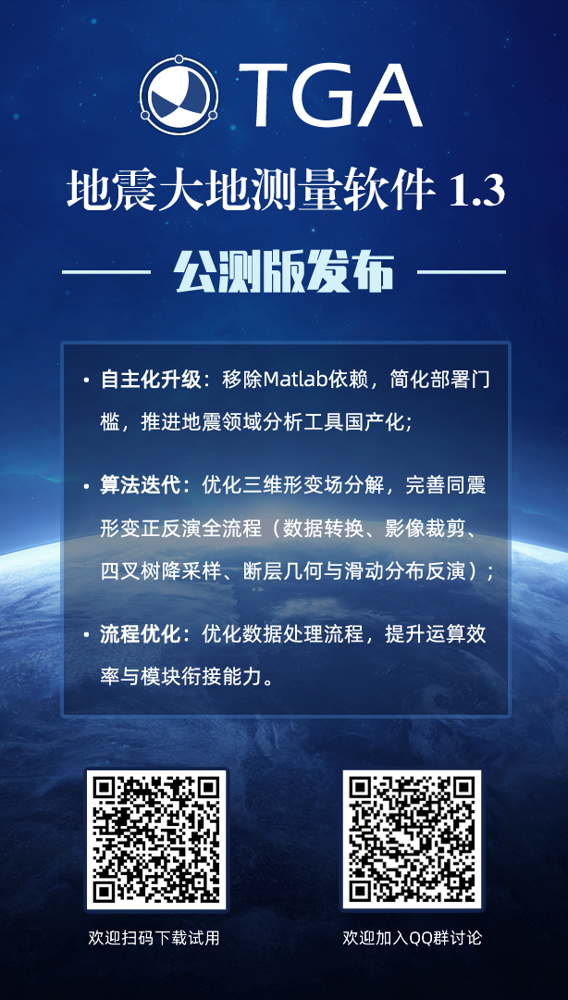

================================
1 Getting Started (软件介绍)
================================

1.1 Introduction (简介)
------------------------

地震（构造）大地测量软件（Tectonic Geodesy Applications, TGA）前身为2009年开发的活动断层地震危险性评估系统。该系统主要功能包括专业绘图、地壳形变和地震目录数据分析、地震位错格林函数计算、同震滑动分布和断层震间闭锁反演等，其中绘图功能基于美国ESRI公司的ArcObjects组件开发实现。由于ArcObjects只支持32位运行模式，导致软件的反演和模型分析能力受到制约。为此，2018年我们开始基于开源的QGIS软件研发64位版本，目标是为构造（地震）大地测量领域贡献一套集2D/3D专业绘图、形变和地震数据分析、地震位错格林函数计算和地震周期形变正/反演等功能为一体的软件。

本软件主要面向从事大地测量、地球物理和地质等方面工作的专业人员，最大的特点是易学易用，所见即所得。目前64位版本软件主要功能包括：

1. 通用和专业数据导入与显示，包括栅格数据、矢量数据、震源机制解、GNSS位移、旋转率、主应变率等；

2. 各类专题图制作，包括构造背景、InSAR形变、折中曲线、滑动分布、断层应力变化等；

3. 专业数据编辑，包括高程、形变、地震数据的提取，经纬度与UTM格式转换，栅格数据的裁剪、拼接、叠加、差分、降采样，以及InSAR数据的反缠绕与合成LOS位移等；

4. 专业数据分析，包括InSAR和DEM栅格数据分析、GNSS数据剖面分析，GNSS数据时序分析，地震目录数据分析等；

5. 断层3D几何模型构建，支持矩形位错元和三角形位错元剖分；

6. 格林函数计算，支持弹性半空间位错模型，以及区域分层地壳位错模型；

7. 同震和震后地表形变和库仑应力扰动计算；

8. 震间地表形变和断裂带应力积累速率计算。

此外，我们也非常欢迎大家基于我们的软件平台定制其他功能模块。如果您在软件使用过程遇到问题，欢迎加入QQ群讨论交流，群号为252716902。

1.2 Download (软件下载)
------------------------------------------------------------------------
:download:`TGA软件下载（GitHub） <https://github.com/wanghai1988/TGA_Publish/releases/download/TGA1.3.2/TGA_Release_v1.3.2.zip>`  :download:`TGA软件下载（百度网盘） <https://pan.baidu.com/s/1hbxSmvIZ9oeogljZ0zko3w?pwd=qreh>` (提取码:qreh)  更新时间：2026年8月14日

:download:`测试数据下载 <https://github.com/wanghai1988/TGA_Data/releases/download/v1/test_data.rar>`  上传时间：2024年9月1日

:download:`同震正反演测试数据下载 <https://github.com/wanghai1988/TGA_Data/releases/download/v3.2/TGA_Test_Date_Coseismic.zip>`  上传时间：2026年7月31日

:download:`Mogi模型正反演测试数据下载 <https://github.com/wanghai1988/TGA_Data/releases/download/v3.1/test_data_Mogi.zip>`  上传时间：2025年7月16日

1.3 Runtime Environment (运行环境)
------------------------------------------------------------------------

(1) 操作系统：软件目前支持Windows 7/10/11 64位操作系统
(2) 运行依赖：

    * 软件发布包已内置 Qt、QGIS、GDAL、PROJ、Python 等核心依赖库，无需用户单独安装。但软件运行需要系统具备 **Microsoft Visual C++ Runtime（VC++ 2015-2022 运行库）**。
    * 软件同时依赖VC++ Runtime，如果出现“找不到VCRUNTIME140_1.dll”类似错误，请参考下列解决方案：`解决方案1 <https://zhuanlan.zhihu.com/p/520529084>`_、`解决方案2 <https://www.bilibili.com/read/cv14363122/>`_

(3) 软件运行注意事项
    
    * 请将TGA软件安装在纯英文目录下，同时确保待加载的相关数据文件路径中，不包含空格、中文字符或其他特殊符号

1.4 Version Update History (版本更新历史)
------------------------------------

==========  ==============  =========
 版本号      更新时间        更新内容 
==========  ==============  =========
 v1.0        2024年1月1日   1. 格林函数计算功能
                            1. 复杂断层建模功能
 v1.1        2024年8月30日  1. 添加同震正/反演功能
                            1. 添加震间3D块体模型正/反演功能
                            2. 添加GNSS数据剖面分析功能
 v1.3        2026年7月31日  1. 去除软件对Matlab的依赖，降低安装使用难度
                            1. 优化三维形变场分解功能
                            2. 全面优化同震形变正反演工作流，完善数据转换、影像裁剪、四叉树降采样、断层几何反演和滑动分布反演功能，提升数据处理效率与流程衔接能力。
==========  ==============  =========

