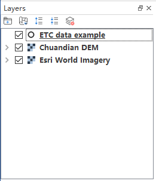
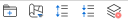
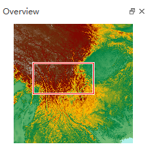
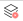

====================
2 GUI (软件界面)
====================

.. image:: ../images/GUI_image/img_gui.png
    :align: center  
    
2.1 Layers (图层列表)
---------------

图层列表是加载数据的关键控件，用户添加的栅格数据、矢量数据、在线数据都会列在图层列表中，用户可以通过右键菜单对图层进行控制。

2.1.1 Layers Toolbar（图层工具栏）
~~~~~~~~~~~~~~~~~~

图层工具栏包括：Add Group（添加分组）、Control Layer Display（控制图层显示）、Expand All（展开全部）、Collapse All（折叠全部）、Remove Layer（移除图层）工具按钮

    1. |Add Group| Add Group（添加分组）按钮：点击该按钮可以在图层列表中，新建一个分组文件夹，可以将图层拖拽进该分组文件夹中，方便在图层数量较多时对图层进行分组管理

    2. |Control Layer Display| Control Layer Display（控制图层显示）下拉按钮：点击该按钮后会弹出一个控制菜单，包括Show All Layers（显示所有图层）、Hide All Layers（隐藏所有图层）、Show Selected Layers（显示选中图层）、Hide Selected Layers（隐藏选中图层）、Hide Deselected Layers（隐藏未选中图层），用户可以通过该菜单控制图层的显示和隐藏

    .. image:: ../images/GUI_image/menu_controlLayerDisplay.png
        :align: center

    3. |Expand All| Expand All（展开全部）按钮：点击该按钮后，可以将分组折叠的图层、以及图层折叠的样式全部展开显示
    4. |Collapse All| Collapse All（折叠全部）按钮：点击该按钮后，可以将图层全部折叠
    5. |Remove Layer| Remove Layer（移除图层）按钮：点击该按钮后，可以移除当前选中的图层

2.1.2 Context Menu（右键菜单）
~~~~~~~~~~~~~~~~~~
右键菜单是用户设置图层重要的控制组件，不同的图层类型所对应的右键菜单也不尽相同

    1. 栅格数据右键菜单
在栅格图层列表上单击右键即可弹出栅格数据右键菜单，菜单包括Zoom to Layer（缩放到图层）、Show in OverLayer（在缩略图中显示）、Remove（移除图层）、Rename Layer（重命名图层）、Symbology Setting（符号化设置）、Duplicate Layer（复制图层副本）、Properties（属性）共7个功能。

    .. image:: ../images/GUI_image/contextmenu_RasterLayer.png
        :align: center

    * Zoom to Layer（缩放到图层）,点击该功能后，地图视图会缩放到该图层范围；
    * Show in OverLayer（在缩略图中显示），点击该功能后，可以控制该图层是否在缩略图中显示或隐藏；
    * Remove（移除图层），点击该功能后，可以移除该图层；
    * Rename Layer（重命名图层），点击该功能后，可以重命名该图层；
    * Symbology Setting（符号化设置），点击该功能后，可以打开符号化设置面板，用于设置栅格图层的显示效果；
    * Duplicate Layer（复制图层副本），点击该功能后，可以复制一个当前图层的副本；
    * Properties（属性），点击该功能后，可以打开当前图层的属性面板。

    2. 矢量数据右键菜单

在矢量图层列表上单击右键即可弹出栅格数据右键菜单，菜单包括Zoom to Layer（缩放到图层）、Show in OverLayer（在缩略图中显示）、Remove（移除图层）、Rename Layer（重命名图层）、Show Feature Count（显示要素数量）、Layer Edit（图层编辑）、Save Layer As（图层另存为）、Open Attribute Table（打开属性表）、Symbology Setting（符号化设置）、Label Features（标注要素）、Duplicate Layer（复制图层副本）、Properties（属性）共12个功能。

    .. image:: ../images/GUI_image/contextmenu_VectorLayer.png
        :align: center

    * Zoom to Layer（缩放到图层）,点击该功能后，地图视图会缩放到该图层范围；
    * Show in OverLayer（在缩略图中显示），点击该功能后，可以控制该图层是否在缩略图中显示或隐藏；
    * Remove（移除图层），点击该功能后，可以移除该图层；
    * Rename Layer（重命名图层），点击该功能后，可以重命名该图层；
    * Show Feature Count（显示要素数量），点击该功能后，可以在图层名称的后面显示图层中要素的数量；
    * Layer Edit（图层编辑），点击该功能后，可以开启图层编辑状态，用户可以对当前图层的要素进行编辑；
    * Save Layer As（图层另存为），点击该功能后，可以将当前图层保存为不同的数据格式；
    * Open Attribute Table（打开属性表），点击该功能后，可以打开当前图层的属性表窗口；
    * Symbology Setting（符号化设置），点击该功能后，可以打开符号化设置面板，用于设置栅格图层的显示效果；
    * Label Features（标注要素），点击该功能后，可以设置当前图层显示的标注及其样式；
    * Duplicate Layer（复制图层副本），点击该功能后，可以复制一个当前图层的副本；
    * Properties（属性），点击该功能后，可以打开当前图层的属性面板。

2.2 Overview (缩略图)
---------------

缩略图也称鹰眼图，用于显示地图的整体范围，Map View主窗体的视图范围在缩略图中以红框表示并联动。当用户在地图主窗体中调整了视图范围，缩略图的红框也随之变化，同样如果在缩略图中调整红框位置也会造成地图主窗体视图的变化。

2.3 Toolbar (工具栏)
---------------

Toolbar（工具栏）是Map View（地图视图）中重要的操作工具，包括了地图缩放、要素选择、图形绘制等功能

    * Pan（平移）
    * Zoom In（放大）
    * Zoom Out（缩小）
    * Zoom Full Extent（缩放到全图）
    * Zoom To Layer（缩放到图层）
    * Zoom To Last（缩放前一视图）
    * Zoom To Next（缩放下一视图）
    * ReDraw（刷新视图）
    * Measure Distance（测量距离）
    * Measure Area（测量面积）
    * Identify Features（查询要素）
    * Select Features（选择要素）
    * Select By Polygon（框选要素）
    * Select By Radius（圆选要素）
    * Deselect All（撤销全部选择）
    * Select All（选择全部）
    * Invert Selection（反选）
    * Pan to Selected（平移到选择）
    * Zoom to Selected（缩放到选择）
    * Attribute Table（属性表）
    * Vertex Tool（顶点工具）
    * Move Feature（移动要素）
    * Add Feature（添加要素）
    * Delete Selected Feature（删除选中要素）
    * Undo（撤销）
    * Redo（重做）
    * Save Layer Edits（保存图层编辑）
    * Stop Edit（停止编辑）
    * Create Marker（创建注记标记）
    * Create Line（创建注记线）
    * Create Polygon（创建注记面）
    * Modify Annotation（修改注记）
    * Save Annotation（保存注记）

