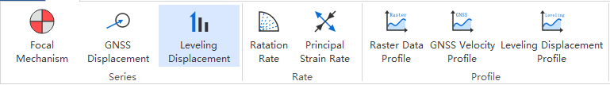
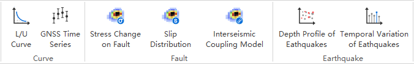

================
2 Menus (菜单)
================

    
2.1 File (文件)
---------------
.. image:: ../images/menu_image/File/menu_file_new.png
    :align: center  

File菜单下包括下列功能：

2.1.1 Open Map（打开地图工程）
~~~~~~~~~~~~~~~~~~

该菜单会打开文件打开对话框，用来打开已经存在的地图工程（后缀为.qgs/.qgz/.QGS/.QGZ），界面如下：

    .. image:: ../images/menu_image/File/dialog_openproject.png
        :align: center
    
2.1.2 Save（保存）
~~~~~~~~~~~~~~~~~~

该菜单用于保存当前地图工程（后缀为.qgs/.qgz/.QGS/.QGZ），如果当前为新建地图工程时，会弹出地图工程保存对话框，界面如下：

    .. image:: ../images/menu_image/File/dialog_saveproject.png
        :align: center
        
2.1.3 Save as（另存为）
~~~~~~~~~~~~~~~~~~

该菜单用于另存当前工程为新的地图工程（后缀为.qgs/.qgz/.QGS/.QGZ），点击后会弹出地图工程另存对话框，界面如下：

    .. image:: ../images/menu_image/File/dialog_saveas.png
        :align: center

2.1.4 Close Map（关闭地图工程）
~~~~~~~~~~~~~~~~~~

该菜单用于关闭当前地图工程

2.1.5 Open Recent（最近工程）
~~~~~~~~~~~~~~~~~~

该菜单用于显示用户最近打开过的地图工程列表

2.1.6 Add Raster Layer（添加栅格图层）
~~~~~~~~~~~~~~~~~~

该菜单用于添加栅格类型地图数据（后缀为.tif/.img/.grd等），点击后会弹出添加栅格数据对话框，界面如下：

    .. image:: ../images/menu_image/File/dailog_addRasterLayer.png
        :align: center
        
2.1.7 Add Vector Layer（添加矢量图层）
~~~~~~~~~~~~~~~~~~

该菜单用于添加矢量类型地图数据（后缀为.shp/.geojson/.kml等），点击后会弹出添加矢量数据对话框，界面如下：

    .. image:: ../images/menu_image/File/dailog_addVectorLayer.png
        :align: center
        
2.1.8 Add Online Map（添加在线地图）
~~~~~~~~~~~~~~~~~~

该菜单用于添加在线地图服务图层如天地图、谷歌地图、ERSI等在线地图服务，界面如下：

    .. image:: ../images/menu_image/File/menu_onlineMap_new.png
        :align: center
        
2.1.9 Export（输出）
~~~~~~~~~~~~~~~~~~

该菜单用于输出当前地图视图，包含2个子菜单，界面如下：

    .. image:: ../images/menu_image/File/menu_export.png
        :align: center
    
  1. 点击Export Map View（输出地图视图），会弹出输出地图视图对话框，用于保存并输出当前地图视图的屏幕效果。
    
    .. image:: ../images/menu_image/File/dailog_exportMapView.png
        :align: center
    参数说明：
    
    * Extent（范围）通过当前地图视图自动进行确定，用户也可以通过手动输入、Calculate from Layer（由图层计算）、Map Canvas Extent（地图画布范围）或Draw on Canvas（手动绘制）自行确定输出的视图范围。
        
    * Scale（比例尺）通常由视图范围自动确定，也可以通过手动输入进行调整。
        
    * Resolution（分辨率）默认为96dpi，用户也可根据自身需要进行调整。
        
    * Output Width（输出宽度）和Output Height（输出高度）用来确定输出图片的尺寸。
        
    * 点击按钮Export（输出）后，会弹出图片保存对话框，用户可自行设置保存路径与格式。
        
  2. 点击Export Layout View（输出布局视图），会弹出布局操作窗口，用于编辑并保存通过布局视图美化后的地图布局效果,详细操作请参考 `2.8 Cartography (制图)`_。
  
    .. image:: ../images/menu_image/File/dialog_setLayoutView.png
        :align: center
    
    

    
2.1.10 Exit（退出）
~~~~~~~~~~~~~~~~~~

2.2 Plot (绘制)
----------------

Plot菜单包括下列功能：

2.2.1 Focal Mechanism（震源机制）
~~~~~~~~~~~~~~~~~~

    震源机制对话框界面如下：
    
    .. image:: ../images/menu_image/Plot/dialog_FocalMechanism.png
        :align: center
    
    使用步骤：
    
    STEP 1：选择或输入 `震源机制解数据（后缀为.fms） <https://qtgahelpdoc.readthedocs.io/en/latest/1%20Getting%20Started%20%28%E8%BD%AF%E4%BB%B6%E4%BB%8B%E7%BB%8D%29.html#id6>`_ 路径 
 
    STEP 2：设置Sytle（样式）和Scale（比例）。其中Style用于设置图标绘制方式，可选项为ALL（全部）、Strike Slip（走滑断层）、Thrust（冲断层）、Normal（正断层）；Scale用于设置图标比例，设置范围为0.01-99
    
    STEP 3：点击Preview（预览）按钮，即可在地图界面查看显示效果
    
    STEP 4：设置输出文件路径（文件格式为geojson），点击Export（输出）按钮即可输出结果文件，勾选Add File To Current Project（添加文件到当前工程）则会将结果文件添加到当前地图工程内。
    
    .. image:: ../images/menu_image/Plot/result_FocalMechanism.png
        :align: center

2.2.2 GNSS Displacement（GNSS形变场）
~~~~~~~~~~~~~~~~~~

    GNSS形变场对话框界面如下：
    
    .. image:: ../images/menu_image/Plot/dialog_GNSSDisplacement.png
        :align: center
    
    使用步骤：
    
    STEP 1：选择或输入 `GNSS形变数据（后缀为.gps） <https://qtgahelpdoc.readthedocs.io/en/latest/1%20Getting%20Started%20%28%E8%BD%AF%E4%BB%B6%E4%BB%8B%E7%BB%8D%29.html#gnss>`_ 路径 
 
    STEP 2：设置Draw Error Ellipse（绘制误差椭圆）、Ellipse Scale（椭圆比例）和Arrow Scale（箭头比例）
      * Draw Error Ellipse（绘制误差椭圆）用于设置是否绘制误差椭圆
      * Ellipse Scale（椭圆比例）用于设置绘制误差椭圆的比例，设置范围为0.01-99.99（注：该选项仅在Draw Error Ellipse勾选时起效）
      * Arrow Scale（箭头比例）其中Style用于设置绘制箭头的比例，设置范围为0.01-99.99
    
    STEP 3：点击Preview（预览）按钮，即可在地图界面查看显示效果
    
    STEP 4：设置输出文件路径（文件格式为geojson），点击Export（输出）按钮即可输出结果文件，勾选Add File To Current Project（添加文件到当前工程）则会将结果文件添加到当前地图工程内。
    
    .. image:: ../images/menu_image/Plot/result_GNSSDisplacement.png
        :align: center

2.2.3 Leveling Displacement（水准形变场）
~~~~~~~~~~~~~~~~~~
    水准形变场对话框界面如下：
    
    .. image:: ../images/menu_image/Plot/dialog_LevelingDisplacement.png
        :align: center

    使用步骤：
    
    STEP 1：选择或输入 `水准形变场数据（后缀为.lev） <https://qtgahelpdoc.readthedocs.io/en/latest/1%20Getting%20Started%20%28%E8%BD%AF%E4%BB%B6%E4%BB%8B%E7%BB%8D%29.html#id3>`_ 路径 
 
    STEP 2：设置Draw Error Circle（绘制误差圆）和Scale（比例）
      * 勾选Draw Error Circle（绘制误差圆）后可绘制绘制误差圆
      * Scale用于设置绘制比例，设置范围为0.01-99.99
    
    STEP 3：点击Preview（预览）按钮，即可在地图界面查看显示效果
    
    STEP 4：设置输出文件路径（文件格式为geojson），点击Export（输出）按钮即可输出结果文件，勾选Add File To Current Project（添加文件到当前工程）则会将结果文件添加到当前地图工程内。
    
    .. image:: ../images/menu_image/Plot/result_LevelingDisplacement.png
        :align: center

2.2.4 Ratation Rate（旋转率场）
~~~~~~~~~~~~~~~~~~
    旋转率场对话框界面如下：
    
    .. image:: ../images/menu_image/Plot/dailog_RotationRate.png
        :align: center

    使用步骤：
    
    STEP 1：选择或输入 `旋转率场数据（后缀为.ror） <https://qtgahelpdoc.readthedocs.io/en/latest/1%20Getting%20Started%20%28%E8%BD%AF%E4%BB%B6%E4%BB%8B%E7%BB%8D%29.html#id5>`_ 路径 
 
    STEP 2：设置Angle Scale（角度比例）、Radius（半径）、Angle Unit（角度单位）
      * Angle Scale（角度比例），设置范围为0.01-99.99
      * Radius（半径），设置范围为0.01-99.99
      * Angle Unit（角度单位），设置范围为0.01-99.99
    
    STEP 3：点击Preview（预览）按钮，即可在地图界面查看显示效果
    
    STEP 4：设置输出文件路径（文件格式为geojson），点击Export（输出）按钮即可输出结果文件，勾选Add File To Current Project（添加文件到当前工程）则会将结果文件添加到当前地图工程内。
    
    .. image:: ../images/menu_image/Plot/result_RotationRate.png
        :align: center

2.2.5 Principal Strain Rate（主应变率）
~~~~~~~~~~~~~~~~~~
    主应变率对话框界面如下：
    
    .. image:: ../images/menu_image/Plot/dialog_PrincipalStrainRate.png
        :align: center
    
    使用步骤：
    
    STEP 1：选择或输入 `主应变率格式（后缀为.psr） <https://qtgahelpdoc.readthedocs.io/en/latest/1%20Getting%20Started%20%28%E8%BD%AF%E4%BB%B6%E4%BB%8B%E7%BB%8D%29.html#id4>`_ 路径 
 
    STEP 2：设置Scale（比例），用于设置绘制比例，设置范围为0.01-99.99
    
    STEP 3：点击Preview（预览）按钮，即可在地图界面查看显示效果
    
    STEP 4：设置输出文件路径（文件格式为geojson），点击Export（输出）按钮即可输出结果文件，勾选Add File To Current Project（添加文件到当前工程）则会将结果文件添加到当前地图工程内。
    
    .. image:: ../images/menu_image/Plot/result_PrincipalStrainRate.png
        :align: center

2.2.6 Raster Data Profile（栅格数据剖面分析）
~~~~~~~~~~~~~~~~~~
    点击 Raster Data Profile（栅格数据剖面分析）按钮后，主界面添加一个数据展示面板，左侧为剖面图，右侧为数据表格，效果如下：
    
    .. image:: ../images/menu_image/Plot/panel_RasterDataProfile.png
        :align: center
    
    使用步骤：
    
    STEP 1：通过File（文件）菜单的Add Raster Layer（添加栅格图层）按钮，添加栅格数据
 
    STEP 2：在面板中Layer（图层）下拉列表中选择需要进行剖面分析的栅格图层
    
    STEP 3：点击下拉列表旁的分析按钮，此时鼠标会变为十字状，即可在地图视图中的栅格数据上绘制出剖面线（鼠标左键画线，右键结束），如图所示：
    
    .. image:: ../images/menu_image/Plot/reault_RasterDataProfile1.png
        :align: center
    
    STEP 4：当剖面线绘制结束后，系统自动绘制出剖面图和对应数据列表，如图所示：
    
    .. image:: ../images/menu_image/Plot/reault_RasterDataProfile2.png
        :align: center

2.2.7 GNSS Velocity Profile（GNSS速度场剖面分析）
~~~~~~~~~~~~~~~~~~
    GNSS速度场剖面分析对话框界面如下：
    
    .. image:: ../images/menu_image/Plot/dialog_GNSSVelocityProfile.png
        :align: center
    
    使用步骤：
    
    STEP 1：选择或输入 `GNSS速度场格式（后缀为.gps） <https://qtgahelpdoc.readthedocs.io/en/latest/1%20Getting%20Started%20%28%E8%BD%AF%E4%BB%B6%E4%BB%8B%E7%BB%8D%29.html#gnss>`_ 路径 
 
    STEP 2：设置Reference Ellipsoid（参考椭球）、L0（研究区中央经线）、Azimuth（方位角）、Original E（初值东方向）、Original N（初始北方向）、Unit（单位）、Component（构成方向）
      * Reference Ellipsoid（参考椭球），可设置为WGS-84（默认）、Krassovsky Ellipsoid、International Ellipsoid 1975椭球
      * L0（研究区中央经线），设置范围为0.00-360
      * Azimuth（方位角）,设置范围为0.00-99.99
      * Original E（初值东方向）,设置范围为0.00-360.00
      * Original N（初始北方向）,设置范围为0.00-360.00
      * Unit（单位）,可根据数据自行设置，默认为mm
      * Component（构成方向）,可设置为parallel（横向）、vertical（竖向）
    
    STEP 3：点击Plot（绘制）按钮，即可在新弹出的图表窗口中看到效果
    
    STEP 4：点击Export（输出）按钮，设置输出文件路径后，即可输出结果文件（文件格式为.gvp）。
    
    .. image:: ../images/menu_image/Plot/reault_GNSSVelocityProfile.png
        :align: center

2.2.8 Leveling Displacement Profile（水准形变场剖面分析）
~~~~~~~~~~~~~~~~~~

    暂缺

2.2.9 L/U Curve（L/U曲线）
~~~~~~~~~~~~~~~~~~
    L/U曲线绘制对话框界面如下：
    
    .. image:: ../images/menu_image/Plot/dialog_LUCurve.png
        :align: center
    
    使用步骤：
    
    STEP 1：选择或输入 `Trade-off数据格式（后缀为.toc）暂缺 <https://qtgahelpdoc.readthedocs.io/en/latest/1%20Getting%20Started%20%28%E8%BD%AF%E4%BB%B6%E4%BB%8B%E7%BB%8D%29.html#gnss>`_ 路径 
 
    STEP 2：点击Plot（绘制）按钮，即可在新弹出的图表窗口中看到效果
    
    结果暂缺

2.2.10 GNSS Time Series（GNSS时间序列）
~~~~~~~~~~~~~~~~~~
    GNSS时间序列对话框界面如下：
    
     .. image:: ../images/menu_image/Plot/dialog_GNSSTimeSeries.png
        :align: center   

    **使用步骤：**

    STEP 1：选择或输入 `TMS数据（后缀为.tms）暂缺 <https://qtgahelpdoc.readthedocs.io/en/latest/1%20Getting%20Started%20%28%E8%BD%AF%E4%BB%B6%E4%BB%8B%E7%BB%8D%29.html#gnss>`_ 路径 
 
    STEP 2：设置Unit（单位）、Start Date（起始日期）、Axis Unit（坐标轴单位）
        * Unit（单位），可根据数据自行设置，默认为mm
        * Start Date（起始日期），该参数由系统从数据自动读取，用户也可手动设置
        * Axis Unit（坐标轴单位），可设置为Day或Year，默认为Day
    
        STEP 3：点击Plot（绘制）按钮，即可在新弹出的图表窗口中看到效果

    .. image:: ../images/menu_image/Plot/result_GNSSTimeSeries.png
        :align: center

2.2.11 Stress Change on Fault（断层应力变化）
~~~~~~~~~~~~~~~~~~

    断层应力变化对话框界面如下：
    
     .. image:: ../images/menu_image/Plot/dailog_StressChangeonFault.png
        :align: center   

    **使用步骤：**

    STEP 1：选择或输入 `断层应力数据（后缀为.cfsr或.cfst）暂缺 <https://qtgahelpdoc.readthedocs.io/en/latest/1%20Getting%20Started%20%28%E8%BD%AF%E4%BB%B6%E4%BB%8B%E7%BB%8D%29.html#gnss>`_ 路径 
 
    STEP 2：设置设置Reference Ellipsoid（参考椭球）、L0（研究区中央经线）、Unit（单位）
      * Reference Ellipsoid（参考椭球），可设置为WGS-84（默认）、Krassovsky Ellipsoid、International Ellipsoid 1975椭球
      * L0（研究区中央经线），设置范围为0.00-360
      * Unit（单位），可自行设置，默认为KPa/yr
    
    STEP 3：点击Plot（绘制）按钮，即可在新弹出的图表窗口中看到效果（暂缺）

    .. image:: ../images/menu_image/Plot/result_StressChangeonFault.png
        :align: center

2.2.12 Slip Distribution（滑动分布）
~~~~~~~~~~~~~~~~~~

    滑动分布对话框界面如下：
    
     .. image:: ../images/menu_image/Plot/dailog_SlipDistribution.png
        :align: center   

    **使用步骤：**

    STEP 1：选择或输入 `位错模型数据格式（后缀为.rec或.tri）暂缺 <https://qtgahelpdoc.readthedocs.io/en/latest/1%20Getting%20Started%20%28%E8%BD%AF%E4%BB%B6%E4%BB%8B%E7%BB%8D%29.html#gnss>`_ 路径 
 
    STEP 2：设置设置Reference Ellipsoid（参考椭球）、L0（研究区中央经线）、Scale（比例）、Draw Allow（绘制箭头）
      * Reference Ellipsoid（参考椭球），可设置为WGS-84（默认）、Krassovsky Ellipsoid、International Ellipsoid 1975椭球
      * L0（研究区中央经线），设置范围为0.00-360
      * Scale用于设置绘制比例，设置范围为0.01-99.99
      * Draw Allow（绘制箭头）用于设置是否绘制箭头
    
    STEP 3：点击Drwa（绘制）按钮，即可在新弹出的图表窗口中看到效果

    .. image:: ../images/menu_image/Plot/result_SlipDistribution.png
        :align: center

2.2.13 Interseismic Coupling Model（震间耦合模型）
~~~~~~~~~~~~~~~~~~

    暂缺

2.2.14 Depth Profile of Earthquakes（地震深度剖面）
~~~~~~~~~~~~~~~~~~

    地震深度剖面对话框界面如下：
    
     .. image:: ../images/menu_image/Plot/dailog_SlipDistribution.png
        :align: center   

2.2.15 Temporal Variation of Earthquakes（地震时间变化）
~~~~~~~~~~~~~~~~~~

    地震时间变化对话框界面如下：
    
     .. image:: ../images/menu_image/Plot/dailog_SlipDistribution.png
        :align: center   

2.3 Tools (工具)
-----------------

Tools菜单包括下列功能：

(1) Construct Fault Geometry，该菜单包括两个子菜单，其中 With Segments Along the Strike Direction 菜单的界面如下：

    .. image:: ../images/menu_image/Tools/WithSegmentsAlong.png
        :align: center  

    With Segments In the Dip Direction 菜单的界面如下：

    .. image:: ../images/menu_image/Tools/WithSegmentsDip.png
        :align: center

(#) Create Checkboard Test Model，该菜单的界面如下：

    .. image:: ../images/menu_image/Tools/CreateCheckboardTestModel.png
       :align: center

(#) Construct Deep Slip Model
(#) Extract EQs Within a Block
(#) Extract Leveling Data Within a Block
(#) Extract GNSS Data Within a Block
(#) Extract InSAR Data Within a Block
(#) Extract Elevation Data
(#) Extract Incidence/Azimuth Angle
(#) Extract cGNSS Coseismic Displacement
(#) Gauss Projection: EN2XY
(#) Gauss Projection: XY2EN
(#) Reference Frame Conversion
(#) Data Format Conversion
(#) Superimpose Images
(#) Extract Fault Segment Parameters
(#) Compress Image
(#) Clip Images

2.4 Analysis (分析)
---------------------

Analysis菜单包括下列功能：

(1) Calculate Min/Max Values，该菜单界面如下： 

    .. image:: ../images/menu_image/Analysis/minmax.png
        :align: center  

(#) Calculate Total Seismic Moment
(#) Compare GNSS/InSAR Displacement，该菜单界面如下： 

.. image:: ../images/menu_image/Analysis/CompareGNSSInSARDisplacement.png
    :align: center  

(#) Estimate Observation Standard Deviation
(#) Correlation between Seismicity and Faults
(#) Correlation between Seismicity and Stressing Rates
(#) Correlation between Aftershocks and CFS Change
(#) Fit Interseismic GNSS Time Series，该菜单界面如下： 

.. image:: ../images/menu_image/Analysis/FitInterseismicGNSSTimeSeries.png
    :align: center  

(#) Correct Postseimic GNSS Time Series，该菜单界面如下： 

.. image:: ../images/menu_image/Analysis/CorrectPostseimicGNSSTimeSeries.png
    :align: center  

(#) Fit Postseimic GNSS Time Series，该菜单界面如下： 

.. image:: ../images/menu_image/Analysis/FitInterseismicGNSSTimeSeries.png
    :align: center  

(#) Fit Temporal Distribution Of Aftershocks，该菜单界面如下：

    .. image:: ../images/menu_image/Analysis/FitTemporalDistributionOfAftershocks.png
       :align: center 

(#) Fit GNSS Velocities

2.5 Forward (正演)
-------------------

Forward菜单包括下列功能：

(1) Forward CoGrnd displacement
(#) Forward CoRegn Sts Change
(#) Forward Fault Co Sts Perturb
(#) Forward Post Ground displacement
(#) Forward Post Regn Sts Change
(#) Forward Fault Post Sts Perturb
(#) Forward Post Dis Poroelastic Rebound
(#) Forward Post Stress Poroelastic Rebound
(#) Forward Inter Grnd Dis
(#) Forward Inter Sts Accumulation
(#) Forward Tectonic Loading NS
(#) Forward Tectonic Loadind DS
(#) Forward Lyr Grn Function

2.6 Invert (反演)
------------------

Invert菜单包括下列功能：

(1) InvertFlt
(#) Invert CoSlip Distribution
(#) Invert Blc Motion And Stn
(#) Invert Reg Tec Stn
(#) Invert Reg Tec Stn LSC
(#) Invert Back Slip Rate
(#) Invert Back Slip Rate 3DEM
(#) Invert Back Slip Rate 3DVM
(#) Invert Stressing Rate
(#) Slip Distribution

2.7 Evaluate (评估)
--------------------

Evaluate菜单包括下列功能：

(1) Count Seismic Moment
(#) Ocurrence Possibility
(#) After shock Duration
(#) Assess Earthquake OccurTime
(#) Stress Disturb Time

2.8 Cartography (制图)
---------------
.. image:: ../images/menu_image/File/dialog_setLayoutView.png
    :align: center
功能说明：

    * |Layout List| Layout List（布局列表）下拉列表：该下拉列表用于显示当前布局视图，点击该下拉列表后，可切换所需的布局。
    * |New Layout| New Layout（新建布局）按钮：点击该按钮后，会弹出New Print Layout（新建打印布局）对话框，要求输入新的唯一布局标题，点击确定后即可生成新布局。
    * |Delete Layout| Delete Layout（删除布局）按钮：点击该按钮后，可删除当前布局。
    * |Save Layout| Save Layout（保存布局）按钮：点击该按钮后，可保存布局的当前状态。
    * |Add Map| Add Map（添加地图）按钮：点击该按钮后，可在当前布局中添加一个新的地图框。
    * |Add Legend| Add Legend（添加图例）按钮：点击该按钮后，可在当前布局中添加一个新的图例。
    * |Add GNSS Legend| Add GNSS Legend（添加GNSS图例）按钮：点击该按钮后，可在当前布局中添加一个新的GNSS图例。
    * |Add Lev Legend| Add Lev Legend（添加水准图例）按钮：点击该按钮后，可在当前布局中添加一个新的水准图例。
    * |Add Rotation Rate Legend| Add Rotation Rate Legend（添加旋转率图例）按钮：点击该按钮后，可在当前布局中添加一个新的旋转率图例。
    * |Add Principal Strain Rate Legend| Add Principal Strain Rate Legend（添加主应变率图例）按钮：点击该按钮后，可在当前布局中添加一个新的主应变率图例。
    * |Add Color Ramp| Add Color Ramp（添加色带）按钮：点击该按钮后，可在当前布局中添加一个新的色带。
    * |Add Label| Add Label（添加标签）按钮：点击该按钮后，可在当前布局中添加一个新的文字标签。
    * |Add Scale Bar| Add Scale Bar（添加比例尺）按钮：点击该按钮后，可在当前布局中添加一个新的比例尺。
    * |Pan| Pan（平移）按钮：点击该按钮后，可通过鼠标平移当前布局视图。
    * |Zoom In| Zoom In（放大）按钮：点击该按钮后，可放大当前布局视图。
    * |Zoom Out| Zoom Out（缩小）按钮：点击该按钮后，可缩小当前布局视图。
    * |Zoom| Zoom（缩放）按钮：点击该按钮后，可通过鼠标控制缩放当前布局视图。
    * |Zoom Actual| Zoom Actual（缩放实际）按钮：点击该按钮后，可缩放当前布局视图到实际位置。
    * |Zoom All| Zoom All（缩放全部）按钮：点击该按钮后，可缩放当前布局视图到包含全部内容。
    * |Refresh| Refresh（刷新）按钮：点击该按钮后，可刷新当前布局视图。
    * |Select/Move Item| Select/Move Item（选择/移动图面要素）按钮：点击该按钮后，可将鼠标切换至选择状态，用于选择图例或图面要素。并可按住鼠标左键拖动图例或图面要素至合适位置。
    * |Move Content| Move Content（移动内容）按钮：点击该按钮后，可操作地图框内的视图范围，移动地图框内的显示内容。
    * |Overview Setting| Overview Setting（缩略图设置）按钮：当布局视图内有2个及以上地图框时，选中一个地图框后，点击该按钮后可将该地图框地图视图设置到全图范围
    * |Grid Setting| Grid Setting（网格设置）按钮：该按钮用于设置地图框相关参数，具体设置参数请参阅 `2.8.1 Grid Setting（网格设置）`_。
    * |Text Setting| Text Setting（文本设置）按钮：该按钮用于设置标签的文本属性，具体设置参数请参阅 `2.8.2 Text Setting（文本设置）`_。
    * |Legend Setting| Legend Setting（图例设置）按钮：该按钮用于设置图例相关参数，具体设置参数请参阅 `2.8.3 Legend Setting（图例设置）`_。
    * |Scalebar Setting| Scalebar Setting（比例尺设置）按钮：该按钮用于设置比例尺相关参数，具体设置参数请参阅 `2.8.4 Scalebar Setting（比例尺设置）`_。
    * |GNSS Setting| GNSS Setting（GNSS图例设置）按钮：该按钮用于设置GNSS图例相关参数，具体设置参数请参阅 `2.8.5 GNSS Setting（GNSS图例设置）`_。
    * |Lev Setting| Lev Setting（水准图例设置）按钮：该按钮用于设置水准图例相关参数，具体设置参数请参阅 `2.8.6 Lev Setting（水准图例设置）`_。
    
    .. |Layout List|      image:: ../images/menu_image/File/select_Layout.png
    .. |New Layout|       image:: ../images/menu_image/File/btn_newLayout.png
    .. |Delete Layout|    image:: ../images/menu_image/File/btn_deleteLayout.png
    .. |Save Layout|      image:: ../images/menu_image/File/btn_saveLayout.png
    .. |Add Map|          image:: ../images/menu_image/File/btn_addMap.png
    .. |Add Legend|       image:: ../images/menu_image/File/btn_addLegend.png
    .. |Add GNSS Legend|  image:: ../images/menu_image/File/btn_addGNSSLegend.png
    .. |Add Lev Legend|   image:: ../images/menu_image/File/btn_addLevLegend.png
    .. |Add Rotation Rate Legend|   image:: ../images/menu_image/File/btn_addRotationRateLegend.png
    .. |Add Principal Strain Rate Legend|   image:: ../images/menu_image/File/btn_addPrincipalStrainLegend.png
    .. |Add Color Ramp|   image:: ../images/menu_image/File/btn_addColorRamp.png
    .. |Add Label|        image:: ../images/menu_image/File/btn_addLabel.png
    .. |Add Scale Bar|    image:: ../images/menu_image/File/btn_addScaleBar.png
    .. |Pan|              image:: ../images/menu_image/File/btn_pan.png
    .. |Zoom In|          image:: ../images/menu_image/File/btn_zoomIn.png
    .. |Zoom Out|         image:: ../images/menu_image/File/btn_zoomOut.png
    .. |Zoom|             image:: ../images/menu_image/File/btn_zoom.png
    .. |Zoom Actual|      image:: ../images/menu_image/File/btn_zoomActual.png
    .. |Zoom All|         image:: ../images/menu_image/File/btn_zoomAll.png
    .. |Refresh|          image:: ../images/menu_image/File/btn_refresh.png
    .. |Select/Move Item| image:: ../images/menu_image/File/btn_selectMoveItem.png
    .. |Move Content|     image:: ../images/menu_image/File/btn_moveContent.png
    .. |Grid Setting|     image:: ../images/menu_image/File/btn_gridSetting.png
    .. |Text Setting|     image:: ../images/menu_image/File/btn_textSetting.png
    .. |Overview Setting| image:: ../images/menu_image/File/btn_overviewSetting.png
    .. |Legend Setting|   image:: ../images/menu_image/File/btn_legendSetting.png
    .. |Add Layer|        image:: ../images/menu_image/File/btn_add.png
    .. |Delete Layer|     image:: ../images/menu_image/File/btn_delete.png
    .. |Edit Layer Name|  image:: ../images/menu_image/File/btn_edit.png
    .. |Scalebar Setting| image:: ../images/menu_image/File/btn_scalebarSetting.png
    .. |GNSS Setting|     image:: ../images/menu_image/File/btn_GNSSSetting.png
    .. |Lev Setting|      image:: ../images/menu_image/File/btn_levSetting.png

2.8.1 Grid Setting（网格设置）
~~~~~~~~~~~~~~~~~~
(1) 选择地图框，如果没有请点击 |Add Map| Add Map（添加地图）按钮添加地图框，激活Grid Setting（网格设置）按钮
(#) 点击该按钮，弹出Map Item Setting对话框，如下图所示：

.. image:: ../images/menu_image/File/dialog_mapItemSetting.png
    :align: center

参数说明：
      * Left Top Lng（左上经度）、Right Bottom Lng（右下经度）、Left Top Lat（左上纬度）、Right Bottom Lat（右下纬度）用于设置地图视图的经纬度范围
      * Interval X（X方向间隔）、Interval Y（Y方向间隔）用于设置坐标轴的刻度间隔
      * Font（字体）、Font Size（字号）、Format（格式）、Precision（有效位数）用于设置坐标刻度值的文字样式
      * Frame Width（边框宽度）用于设置地图框的边框宽度
      * Coordinate Visible中的Left Side、Right Side、Top Side、Bottom Side用于设置边框上下左右是否显示
      * OverView（缩略图）只有在Layout View（布局视图）内有2个及以上地图框时才会激活，Linked Map（连接地图）用于指定对应的缩略图地图框，Fill Color（填充色）和Frame Color（边框颜色）用于设置缩略图中对应地图范围的填充色和边框的颜色
      * Visible Layers（显示图层）中会列出当前地图视图中应用的图层列表

(3) 根据出图需要设置完相关参数后，点击“Apply”按钮即可保存并预览设置效果

2.8.2 Text Setting（文本设置）
~~~~~~~~~~~~~~~~~~
(1) 选择一个文本标签，如果没有请点击 |Add Label| Add Label（添加标签）按钮添加一个文本标签，激活Text Setting（文本设置）按钮
(2) 点击该按钮，弹出Label Edit对话框，如下图所示：

.. image:: ../images/menu_image/File/dialog_labelEdit.png
    :align: center
    
参数说明：
      * Font（字体）、Font Color（字体颜色）用于设置标签文字的字号、字体、颜色等效果
      * Horizontal Margin（水平边距）、Vertical Margin（垂直边距）用于设置文本与标签框之间在水平方向和垂直方向上的距离
      * Horizontal Alignment（水平对齐）、Vertical Alignment（垂直对齐）用于设置文本在标签框内的对齐方式
      * Rotation（旋转）用于设置文本的旋转角度
(3) 根据需要设置完相关参数后，点击“Apply”按钮即可保存并预览设置效果

2.8.3 Legend Setting（图例设置）
~~~~~~~~~~~~~~~~~~
(1) 选择一个图例，如果没有请点击 |Add Legend| Add Legend（添加图例）按钮添加一个图例，激活Legend Setting（图例设置）按钮
(2) 点击该按钮，弹出Legend Setting对话框，如下图所示：

.. image:: ../images/menu_image/File/dialog_legendSetting.png
    :align: center
    
参数说明：
      * 点击图层列表下方的 |Add Layer| “+”号按钮可以添加视图中未加入的图层， |Delete Layer| “-”号按钮可以删除视图中不需要的图层， |Edit Layer Name| 编辑按钮可以编辑图层名称
      * Legend Width（图例宽度）、Legend Height（图例高度）用于设置整个图例的宽度和高度
      * Legend Direction（图例方向）用于设置图例中项目的排列方向为横向或纵向
      * Legend Font（图例字体）、Font Color（字体颜色）用于设置图例中文本的字体、字号、颜色等样式
      * Item Background（背景色）如果勾选Transparent则图例背景透明，否则为白色背景
      * Item Columns（项目）用于设置图例中条目排列的列数
(3) 根据需要设置完相关参数后，点击“Apply”按钮即可保存并预览设置效果

2.8.4 Scalebar Setting（比例尺设置）
~~~~~~~~~~~~~~~~~~
(1) 选择一个比例尺，如果没有请点击 |Add Scale Bar| Add Scale Bar（添加比例尺）按钮添加一个比例尺，激活Scalebar Setting（比例尺设置）按钮
(2) 点击该按钮，弹出Scalebar Setting对话框，如下图所示：

.. image:: ../images/menu_image/File/dialog_ScaleBarSetting.png
    :align: center
    
参数说明：
      * Scalebar Style（比例尺样式）用于设置比例尺的显示样式，可选包括Single Box（单盒式）、Double Box（双盒式）、Line Ticks Middle（中线段式）、Line Ticks Down（下线段式）、Line Ticks Up（上线段式）、Stepped Line（折线式）、Hollow（空心式）、Numeric（数字式）
      * Scalebar Height（比例尺高度）、Scalebar Width（比例尺宽度）用于设置比例尺高宽
      * Rotation（角度）用于设置比例尺旋转角度
      * Frame Width（边框宽度）用于设置比例尺边框宽度
      * Unit Label（单位标签）用于设置比例尺显示的标签单位，默认为km
      * Label Margin（标签间距）用于设置标签与比例尺之间的距离
      * Label Font（标签字体）用于设置比例尺标签的字体、字号、颜色等样式
(3) 根据需要设置完相关参数后，点击“Apply”按钮即可保存并预览设置效果

2.8.5 GNSS Setting（GNSS图例设置）
~~~~~~~~~~~~~~~~~~
(1) 选择一个GNSS图例，如果没有请点击 |Add GNSS Legend| Add GNSS Legend（添加GNSS图例）按钮添加一个GNSS图例，激活GNSS Setting（GNSS图例设置）按钮
(2) 点击该按钮，弹出GNSS Setting对话框，如下图所示：

.. image:: ../images/menu_image/File/dialog_GNSSSetting.png
    :align: center
    
参数说明：
      * Map Scale（地图比例尺）用于设置图例采用的地图比例尺，默认为布局视图中当前的地图比例尺
      * Displacement Length（位移长度）用于设置图例中GNSS Arrow（GNSS箭头）的位移长度尺寸
      * Arrow Scale（箭头比例）用于设置图例中GNSS Arrow（GNSS箭头）的箭头比例大小
      * Error Radius（误差半径）用于设置图例中GNSS Error Ellipse（GNSS误差椭圆）的椭圆半径
      * Ellipse Scale（椭圆比例）用于设置图例中GNSS Error Ellipse（GNSS误差椭圆）中椭圆的比例
      * Text（文字）、Font（字体）、Font Size(字号)、Font Color（颜色）用于设置图例中GNSS Text（GNSS文字标注）的文字内容、字体字族、字号大小和文字颜色
(3) 根据需要设置完相关参数后，点击“Apply”按钮即可保存并预览设置效果

2.8.6 Lev Setting（水准图例设置）
~~~~~~~~~~~~~~~~~~
(1) 选择一个水准图例，如果没有请点击 |Add Lev Legend| Add Lev Legend（添加水准图例）按钮添加一个水准图例，激活Lev Setting（水准图例设置）按钮
(2) 点击该按钮，弹出Lev Setting对话框，如下图所示：

.. image:: ../images/menu_image/File/dialog_LevSetting.png
    :align: center
    
参数说明：
      * Map Scale（地图比例尺）用于设置图例采用的地图比例尺，默认为布局视图中当前的地图比例尺
      * Displacement Length（位移长度）用于设置图例中Lev Arrow（水准箭头）的位移长度尺寸
      * Arrow Scale（箭头比例）用于设置图例中Lev Arrow（水准箭头）的箭头比例大小
      * Error Radius（误差半径）用于设置图例中Lev Error Ellipse（水准误差椭圆）的椭圆半径
      * Ellipse Scale（椭圆比例）用于设置图例中Lev Error Ellipse（水准误差椭圆）中椭圆的比例
      * Text（文字）、Font（字体）、Font Size(字号)、Font Color（颜色）用于设置图例中Lev Text（Lev文字标注）的文字内容、字体字族、字号大小和文字颜色
(3) 根据需要设置完相关参数后，点击“Apply”按钮即可保存并预览设置效果
