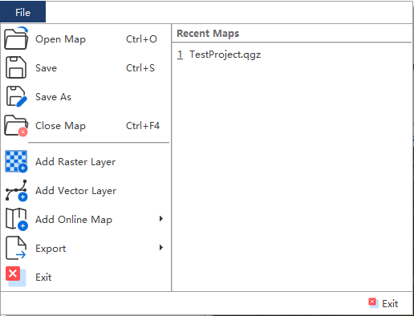

================
2 Menus (菜单)
================

    
2.1 File (文件)
---------------

File菜单下包括下列功能：

(1) Open Map（打开地图工程），该菜单会打开文件打开对话框，用来打开已经存在的地图工程（后缀为.qgs/.qgz/.QGS/.QGZ），界面如下：

    .. image:: ../images/menu_image/File/dialog_openproject.png
        :align: center
    
(2) Save（保存），该菜单用于保存当前地图工程（后缀为.qgs/.qgz/.QGS/.QGZ），如果当前为新建地图工程时，会弹出地图工程保存对话框，界面如下：

    .. image:: ../images/menu_image/File/dialog_saveproject.png
        :align: center
        
(3) Save as（另存为），该菜单用于另存当前工程为新的地图工程（后缀为.qgs/.qgz/.QGS/.QGZ），点击后会弹出地图工程另存对话框，界面如下：

    .. image:: ../images/menu_image/File/dialog_saveas.png
        :align: center

(4) Close Map（关闭地图工程），该菜单用于关闭当前地图工程
(5) Open Recent（最近工程），该菜单用于显示用户最近打开过的地图工程列表
(6) Add Raster Layer（添加栅格图层），该菜单用于添加栅格类型地图数据（后缀为.tif/.img/.grd等），点击后会弹出添加栅格数据对话框，界面如下：

    .. image:: ../images/menu_image/File/dailog_addRasterLayer.png
        :align: center
        
(7) Add Vector Layer（添加矢量图层），该菜单用于添加矢量类型地图数据（后缀为.shp/.geojson/.kml等），点击后会弹出添加矢量数据对话框，界面如下：

    .. image:: ../images/menu_image/File/dailog_addVectorLayer.png
        :align: center
        
(8) Add Online Map（添加在线地图），该菜单用于添加在线地图服务图层如天地图、谷歌地图、ERSI等在线地图服务，界面如下：

    .. image:: ../images/menu_image/File/menu_onlineMap.png
        :align: center
        
(9) Export（输出），该菜单用于输出当前地图视图，包含2个子菜单，界面如下：

    .. image:: ../images/menu_image/File/menu_export.png
        :align: center
    
  A. 点击Export Map View（输出地图视图），会弹出输出地图视图对话框，用于保存并输出当前地图视图的屏幕效果。
    
    .. image:: ../images/menu_image/File/dailog_exportMapView.png
        :align: center
    参数说明：
    * Extent（范围）通过当前地图视图自动进行确定，用户也可以通过手动输入、Calculate from Layer（由图层计算）、Map Canvas Extent（地图画布范围）或Draw on Canvas（手动绘制）自行确定输出的视图范围。
        
    * Scale（比例尺）通常由视图范围自动确定，也可以通过手动输入进行调整。
        
    * Resolution（分辨率）默认为96dpi，用户也可根据自身需要进行调整。
        
    * Output Width（输出宽度）和Output Height（输出高度）用来确定输出图片的尺寸。
        
    * 点击按钮Export（输出）后，会弹出图片保存对话框，用户可自行设置保存路径与格式。
        
  B. 点击Export Layout View（输出布局视图），会弹出布局操作窗口，用于编辑并保存通过布局视图美化后的地图布局效果。
    
    
(10) Exit（退出）

2.2 Plot (绘制)
----------------
.. image:: ../images/menu_image/Plot/menu_plot1.png
    :align: center
.. image:: ../images/menu_image/Plot/menu_plot2.png
    :align: center

Plot菜单包括下列功能：

(1) Focal Mechanism（震源机制）

    震源机制对话框界面如下：
    
    .. image:: ../images/menu_image/Plot/dialog_FocalMechanism.png
        :align: center
    
    使用步骤：
    
    STEP 1：选择或输入 `震源机制解数据（后缀为.fms） <https://qtgahelpdoc.readthedocs.io/en/latest/1%20Getting%20Started%20%28%E8%BD%AF%E4%BB%B6%E4%BB%8B%E7%BB%8D%29.html#id6>`_ 路径 
 
    STEP 2：设置Sytle（样式）和Scale（比例）。其中Style用于设置图标绘制方式，可选项为ALL（全部）、Strike Slip（走滑断层）、Thrust（冲断层）、Normal（正断层）；Scale用于设置图标比例，设置范围为0.01-99
    
    STEP 3：点击Preview（预览）按钮，即可在地图界面查看显示效果
    
    STEP 4：设置输出文件路径（文件格式为geojson），点击Export（输出）按钮即可输出结果文件，勾选Add File To Current Project（添加文件到当前工程）则会将结果文件添加到当前地图工程内。
    
    .. image:: ../images/menu_image/Plot/result_FocalMechanism.png
        :align: center

(2) GNSS Displacement（GNSS形变场）

    GNSS形变场对话框界面如下：
    
    .. image:: ../images/menu_image/Plot/dialog_GNSSDisplacement.png
        :align: center
    
    使用步骤：
    
    STEP 1：选择或输入 `GNSS形变数据（后缀为.gps） <https://qtgahelpdoc.readthedocs.io/en/latest/1%20Getting%20Started%20%28%E8%BD%AF%E4%BB%B6%E4%BB%8B%E7%BB%8D%29.html#gnss>`_ 路径 
 
    STEP 2：设置Draw Error Ellipse（绘制误差椭圆）、Ellipse Scale（椭圆比例）和Arrow Scale（箭头比例）
      * Draw Error Ellipse（绘制误差椭圆）用于设置是否绘制误差椭圆
      * Ellipse Scale（椭圆比例）用于设置绘制误差椭圆的比例，设置范围为0.01-99（注：该选项仅在Draw Error Ellipse勾选时起效）
      * Arrow Scale（箭头比例）其中Style用于设置绘制箭头的比例，设置范围为0.01-99
    
    STEP 3：点击Preview（预览）按钮，即可在地图界面查看显示效果
    
    STEP 4：设置输出文件路径（文件格式为geojson），点击Export（输出）按钮即可输出结果文件，勾选Add File To Current Project（添加文件到当前工程）则会将结果文件添加到当前地图工程内。
    
    .. image:: ../images/menu_image/Plot/result_GNSSDisplacement.png
        :align: center

(3) Leveling Displacement（水准形变场）

    水准形变场对话框界面如下：
    
    .. image:: ../images/menu_image/Plot/dialog_LevelingDisplacement.png
        :align: center

    使用步骤：
    
    STEP 1：选择或输入 `水准形变场数据（后缀为.lev） <https://qtgahelpdoc.readthedocs.io/en/latest/1%20Getting%20Started%20%28%E8%BD%AF%E4%BB%B6%E4%BB%8B%E7%BB%8D%29.html#id3>`_ 路径 
 
    STEP 2：设置Draw Error Circle（绘制误差圆）和Scale（比例）
      * 勾选Draw Error Circle（绘制误差圆）后可绘制绘制误差圆
      * Scale用于设置绘制比例，设置范围为0.01-99
    
    STEP 3：点击Preview（预览）按钮，即可在地图界面查看显示效果
    
    STEP 4：设置输出文件路径（文件格式为geojson），点击Export（输出）按钮即可输出结果文件，勾选Add File To Current Project（添加文件到当前工程）则会将结果文件添加到当前地图工程内。
    
    .. image:: ../images/menu_image/Plot/result_LevelingDisplacement.png
        :align: center

(4) Ratation Rate（旋转率场）

    旋转率场对话框界面如下：
    
    .. image:: ../images/menu_image/Plot/dailog_RotationRate.png
        :align: center

    使用步骤：
    
    STEP 1：选择或输入 `旋转率场数据（后缀为.ror） <https://qtgahelpdoc.readthedocs.io/en/latest/1%20Getting%20Started%20%28%E8%BD%AF%E4%BB%B6%E4%BB%8B%E7%BB%8D%29.html#id5>`_ 路径 
 
    STEP 2：设置Angle Scale（角度比例）、Radius（半径）、Angle Unit（角度单位）
      * Angle Scale（角度比例），设置范围为0.01-99
      * Radius（半径），设置范围为0.01-99
      * Angle Unit（角度单位），设置范围为0.01-99
    
    STEP 3：点击Preview（预览）按钮，即可在地图界面查看显示效果
    
    STEP 4：设置输出文件路径（文件格式为geojson），点击Export（输出）按钮即可输出结果文件，勾选Add File To Current Project（添加文件到当前工程）则会将结果文件添加到当前地图工程内。
    
    .. image:: ../images/menu_image/Plot/result_RotationRate.png
        :align: center

(5) Principal Strain Rate（主应变率）
    主应变率对话框界面如下：
    
    .. image:: ../images/menu_image/Plot/dialog_PrincipalStrainRate.png
        :align: center
    
    使用步骤：
    
    STEP 1：选择或输入 `主应变率格式（后缀为.psr） <https://qtgahelpdoc.readthedocs.io/en/latest/1%20Getting%20Started%20%28%E8%BD%AF%E4%BB%B6%E4%BB%8B%E7%BB%8D%29.html#id4>`_ 路径 
 
    STEP 2：设置Scale（比例），用于设置绘制比例，设置范围为0.01-99
    
    STEP 3：点击Preview（预览）按钮，即可在地图界面查看显示效果
    
    STEP 4：设置输出文件路径（文件格式为geojson），点击Export（输出）按钮即可输出结果文件，勾选Add File To Current Project（添加文件到当前工程）则会将结果文件添加到当前地图工程内。
    
    .. image:: ../images/menu_image/Plot/result_PrincipalStrainRate.png
        :align: center

(6) Raster Data Profile（栅格数据剖面）
    点击 Raster Data Profile（栅格数据剖面）按钮后，主界面添加一个数据展示面板，左侧为剖面图，右侧为数据表格，效果如下：
    
    .. image:: ../images/menu_image/Plot/panel_RasterDataProfile.png
        :align: center
    
    使用步骤：
    
    STEP 1：通过File（文件）菜单的Add Raster Layer（添加栅格图层）按钮，添加栅格数据
 
    STEP 2：在面板中Layer（图层）下拉列表中选择需要进行剖面分析的栅格图层
    
    STEP 3：点击下拉列表旁的分析按钮，此时鼠标会变为十字状，即可在地图视图中的栅格数据上绘制出剖面线（鼠标左键画线，右键结束），如图所示
    .. image:: ../images/menu_image/Plot/reault_RasterDataProfile1.png
        :align: center
    
    STEP 4：当剖面线绘制结束后，系统自动绘制出剖面图和对应数据列表。
    
    .. image:: ../images/menu_image/Plot/reault_RasterDataProfile2.png
        :align: center

(#) GNSS Time Series

(#) Leveling Displacement Profile
(#) Raster Data Profile
(#) GNSS Velocity Profile
(#) 
(#) Coseismic Slip Distribution
(#) Interseismic Coupling Model
(#) CFS Change on Fault Plane
(#) L/U Curve
(#) Depth Profile of EQs
(#) Temporal Variation of EQs

2.3 Tools (工具)
-----------------

Tools菜单包括下列功能：

(1) Construct Fault Geometry，该菜单包括两个子菜单，其中 With Segments Along the Strike Direction 菜单的界面如下：

    .. image:: ../images/menu_image/Tools/WithSegmentsAlong.png
        :align: center  

    With Segments In the Dip Direction 菜单的界面如下：

    .. image:: ../images/menu_image/Tools/WithSegmentsDip.png
        :align: center

(#) Create Checkboard Test Model，该菜单的界面如下：

    .. image:: ../images/menu_image/Tools/CreateCheckboardTestModel.png
       :align: center

(#) Construct Deep Slip Model
(#) Extract EQs Within a Block
(#) Extract Leveling Data Within a Block
(#) Extract GNSS Data Within a Block
(#) Extract InSAR Data Within a Block
(#) Extract Elevation Data
(#) Extract Incidence/Azimuth Angle
(#) Extract cGNSS Coseismic Displacement
(#) Gauss Projection: EN2XY
(#) Gauss Projection: XY2EN
(#) Reference Frame Conversion
(#) Data Format Conversion
(#) Superimpose Images
(#) Extract Fault Segment Parameters
(#) Compress Image
(#) Clip Images

2.4 Analysis (分析)
---------------------

Analysis菜单包括下列功能：

(1) Calculate Min/Max Values，该菜单界面如下： 

    .. image:: ../images/menu_image/Analysis/minmax.png
        :align: center  

(#) Calculate Total Seismic Moment
(#) Compare GNSS/InSAR Displacement，该菜单界面如下： 

.. image:: ../images/menu_image/Analysis/CompareGNSSInSARDisplacement.png
    :align: center  

(#) Estimate Observation Standard Deviation
(#) Correlation between Seismicity and Faults
(#) Correlation between Seismicity and Stressing Rates
(#) Correlation between Aftershocks and CFS Change
(#) Fit Interseismic GNSS Time Series，该菜单界面如下： 

.. image:: ../images/menu_image/Analysis/FitInterseismicGNSSTimeSeries.png
    :align: center  

(#) Correct Postseimic GNSS Time Series，该菜单界面如下： 

.. image:: ../images/menu_image/Analysis/CorrectPostseimicGNSSTimeSeries.png
    :align: center  

(#) Fit Postseimic GNSS Time Series，该菜单界面如下： 

.. image:: ../images/menu_image/Analysis/FitInterseismicGNSSTimeSeries.png
    :align: center  

(#) Fit Temporal Distribution Of Aftershocks，该菜单界面如下：

    .. image:: ../images/menu_image/Analysis/FitTemporalDistributionOfAftershocks.png
       :align: center 

(#) Fit GNSS Velocities

2.5 Forward (正演)
-------------------

Forward菜单包括下列功能：

(1) Forward CoGrnd displacement
(#) Forward CoRegn Sts Change
(#) Forward Fault Co Sts Perturb
(#) Forward Post Ground displacement
(#) Forward Post Regn Sts Change
(#) Forward Fault Post Sts Perturb
(#) Forward Post Dis Poroelastic Rebound
(#) Forward Post Stress Poroelastic Rebound
(#) Forward Inter Grnd Dis
(#) Forward Inter Sts Accumulation
(#) Forward Tectonic Loading NS
(#) Forward Tectonic Loadind DS
(#) Forward Lyr Grn Function

2.6 Invert (反演)
------------------

Invert菜单包括下列功能：

(1) InvertFlt
(#) Invert CoSlip Distribution
(#) Invert Blc Motion And Stn
(#) Invert Reg Tec Stn
(#) Invert Reg Tec Stn LSC
(#) Invert Back Slip Rate
(#) Invert Back Slip Rate 3DEM
(#) Invert Back Slip Rate 3DVM
(#) Invert Stressing Rate
(#) Slip Distribution

2.7 Evaluate (评估)
--------------------

Evaluate菜单包括下列功能：

(1) Count Seismic Moment
(#) Ocurrence Possibility
(#) After shock Duration
(#) Assess Earthquake OccurTime
(#) Stress Disturb Time
