======================
3 Function (功能介绍)
======================

    
3.1 File (文件)
---------------
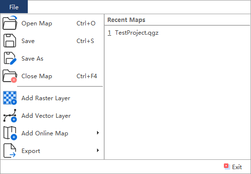

File菜单下包括下列功能：

3.1.1 Open Map（打开地图工程）
~~~~~~~~~~~~~~~~~~

该菜单会打开文件打开对话框，用来打开已经存在的地图工程（后缀为.qgs/.qgz/.QGS/.QGZ），界面如下：

    .. image:: ../images/menu_image/File/dialog_openproject.png
        :align: center
    
3.1.2 Save（保存）
~~~~~~~~~~~~~~~~~~

该菜单用于保存当前地图工程（后缀为.qgs/.qgz/.QGS/.QGZ），如果当前为新建地图工程时，会弹出地图工程保存对话框，界面如下：

    .. image:: ../images/menu_image/File/dialog_saveproject.png
        :align: center
        
3.1.3 Save as（另存为）
~~~~~~~~~~~~~~~~~~

该菜单用于另存当前工程为新的地图工程（后缀为.qgs/.qgz/.QGS/.QGZ），点击后会弹出地图工程另存对话框，界面如下：

    .. image:: ../images/menu_image/File/dialog_saveas.png
        :align: center

3.1.4 Close Map（关闭地图工程）
~~~~~~~~~~~~~~~~~~

该菜单用于关闭当前地图工程

3.1.5 Open Recent（最近工程）
~~~~~~~~~~~~~~~~~~

该菜单用于显示用户最近打开过的地图工程列表

3.1.6 Add Raster Layer（添加栅格图层）
~~~~~~~~~~~~~~~~~~

该菜单用于添加栅格类型地图数据（后缀为.tif/.img/.grd等），点击后会弹出添加栅格数据对话框，界面如下：

    .. image:: ../images/menu_image/File/dailog_addRasterLayer.png
        :align: center
        
3.1.7 Add Vector Layer（添加矢量图层）
~~~~~~~~~~~~~~~~~~

该菜单用于添加矢量类型地图数据（后缀为.shp/.geojson/.kml等），点击后会弹出添加矢量数据对话框，界面如下：

    .. image:: ../images/menu_image/File/dailog_addVectorLayer.png
        :align: center
        
3.1.8 Add Online Map（添加在线地图）
~~~~~~~~~~~~~~~~~~

该菜单用于添加在线地图服务图层如天地图、谷歌地图、ERSI等在线地图服务，界面如下：

    .. image:: ../images/menu_image/File/menu_onlineMap_new.png
        :align: center
        
3.1.9 Export（输出）
~~~~~~~~~~~~~~~~~~

该菜单用于输出当前地图视图，包含2个子菜单，界面如下：

    .. image:: ../images/menu_image/File/menu_export.png
        :align: center
    
  1. 点击Export Map View（输出地图视图），会弹出输出地图视图对话框，用于保存并输出当前地图视图的屏幕效果。
    
    .. image:: ../images/menu_image/File/dailog_exportMapView.png
        :align: center
    参数说明：
    
    * Extent（范围）通过当前地图视图自动进行确定，用户也可以通过手动输入、Calculate from Layer（由图层计算）、Map Canvas Extent（地图画布范围）或Draw on Canvas（手动绘制）自行确定输出的视图范围。
        
    * Scale（比例尺）通常由视图范围自动确定，也可以通过手动输入进行调整。
        
    * Resolution（分辨率）默认为96dpi，用户也可根据自身需要进行调整。
        
    * Output Width（输出宽度）和Output Height（输出高度）用来确定输出图片的尺寸。
        
    * 点击按钮Export（输出）后，会弹出图片保存对话框，用户可自行设置保存路径与格式。
        
  2. 点击Export Layout View（输出布局视图），会弹出布局操作窗口，用于编辑并保存通过布局视图美化后的地图布局效果，详细操作请参考 `2.8 Cartography (制图)`_。
  
    .. image:: ../images/menu_image/File/dialog_setLayoutView.png
        :align: center
    
    

    
3.1.10 Exit（退出）
~~~~~~~~~~~~~~~~~~

3.2 Plot (绘制)
----------------

Plot (绘制)菜单主要包括Focal Mechanism（震源机制）、 GNSS Displacement（GNSS形变场）、Leveling Displacement（水准形变场）等12项绘制功能，如图所示：

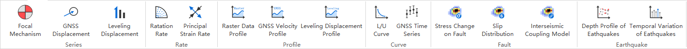

具体包括下列功能：

3.2.1 Focal Mechanism（震源机制）
~~~~~~~~~~~~~~~~~~

    震源机制对话框界面如下：
    
    .. image:: ../images/menu_image/Plot/dialog_FocalMechanism.png
        :align: center
    
    使用步骤：
    
    STEP 1：选择或输入 `震源机制解数据（后缀为.fms） <https://qtgahelpdoc.readthedocs.io/en/latest/4%20File%20Format%20%28%E6%96%87%E4%BB%B6%E6%A0%BC%E5%BC%8F%29.html#id5>`_ 路径 
 
    STEP 2：设置Sytle（样式）和Scale（比例）。其中Style用于设置图标绘制方式，可选项为ALL（全部）、Strike Slip（走滑断层）、Thrust（逆冲断层）、Normal（正断层）；Scale用于设置图标比例，设置范围为0.01-99
    
    STEP 3：点击Preview（预览）按钮，即可在地图界面查看显示效果
    
    STEP 4：设置输出文件路径（文件格式为geojson），点击Export（输出）按钮即可输出结果文件，勾选Add File To Current Project（添加文件到当前工程）则会将结果文件添加到当前地图工程内。
    
    .. image:: ../images/menu_image/Plot/result_FocalMechanism.png
        :align: center

3.2.2 GNSS Displacement（GNSS形变场）
~~~~~~~~~~~~~~~~~~

    GNSS形变场对话框界面如下：
    
    .. image:: ../images/menu_image/Plot/dialog_GNSSDisplacement.png
        :align: center
    
    使用步骤：
    
    STEP 1：选择或输入 `GNSS形变数据（后缀为.gnss） <https://qtgahelpdoc.readthedocs.io/en/latest/4%20File%20Format%20%28%E6%96%87%E4%BB%B6%E6%A0%BC%E5%BC%8F%29.html#gnss>`_ 路径 
 
    STEP 2：设置Draw Arrow（绘制矢量）、Draw Error Ellipse（绘制误差椭圆），主要包含以下参数：
      * Line Length Scale（线条长度比例尺）
      * Line Width（线条宽度）
      * Line Color（线条颜色）
      * Head Type（箭头类型）用于设置矢量箭头的类型，包含三角形（triangle）和梭形（dart）
      * Head Length（箭头长度）
      * Head Width（箭头宽度）用于设置整个矢量箭头的宽度
      * Head Stroke Width（箭头边框的宽度）用于设置矢量箭头边框迹线的线条宽度
      * Head Stroke Color（箭头边框的颜色）用于设置矢量箭头边框迹线的线条颜色
      * Head Fill Color（箭头填充色）用于设置矢量箭头内部的填充色
      * Ellipse Scale（椭圆比例尺）
      * Fill Color（椭圆填充色）用于设置整个椭圆内部的填充色
      * Stroke Width（边框的宽度）用于设置椭圆边框迹线的线条宽度
      * Stroke Color（边框的颜色）用于设置椭圆边框迹线的线条颜色
    
    STEP 3：点击Preview（预览）按钮，即可在地图界面查看显示效果
    
    STEP 4：点击Add（添加）则会将当前预览的GNSS矢量数据添加到当前地图工程内。
    
    .. image:: ../images/menu_image/Plot/result_GNSSDisplacement.png
        :align: center

3.2.3 Leveling Displacement（水准形变场）
~~~~~~~~~~~~~~~~~~
    水准形变场对话框界面如下：
    
    .. image:: ../images/menu_image/Plot/dialog_LevelingDisplacement.png
        :align: center

    使用步骤：
    
    STEP 1：选择或输入 `水准形变数据（后缀为.lev） <https://qtgahelpdoc.readthedocs.io/en/latest/4%20File%20Format%20%28%E6%96%87%E4%BB%B6%E6%A0%BC%E5%BC%8F%29.html#id3>`_ 路径 
 
    STEP 2：设置Draw Error Arrow（绘制误差圆）和Scale（比例）
      * 勾选Draw Error Circle（绘制误差圆）后可绘制绘制误差圆
      * Scale用于设置绘制比例，设置范围为0.01-99.99
    
    STEP 3：点击Preview（预览）按钮，即可在地图界面查看显示效果
    
    STEP 4：设置输出文件路径（文件格式为geojson），点击Export（输出）按钮即可输出结果文件，勾选Add File To Current Project（添加文件到当前工程）则会将结果文件添加到当前地图工程内。
    
    .. image:: ../images/menu_image/Plot/result_LevelingDisplacement.png
        :align: center

3.2.4 Ratation Rate（旋转率场）
~~~~~~~~~~~~~~~~~~
    旋转率场对话框界面如下：
    
    .. image:: ../images/menu_image/Plot/dialog_RotationRate2.png
        :align: center

    使用步骤：
    
    STEP 1：选择或输入 `主应变率-旋转率场数据输入格式.rsr <https://qtgahelpdoc.readthedocs.io/en/latest/4%20File%20Format%20%28%E6%96%87%E4%BB%B6%E6%A0%BC%E5%BC%8F%29.html#id4>`_ 路径 
 
    STEP 2：设置Radius（半径）、Radius Scale（半径比例）、Angle Unit（角度单位）、Stroke Color（划线颜色）、Fill Color（填充颜色）
      * Angle Scale（角度比例），设置范围为0.01-99.99
      * Radius（半径），设置范围为0.01-99.99
      * Angle Unit（角度单位），设置范围为0.01-99.99
      * Radius Scale（半径比例），设置范围为0.01-99.99
      * Stroke Color（划线颜色），默认设置为黑色
      * Fill Color（填充颜色），默认设置为透明
    
    STEP 3：点击Preview（预览）按钮，即可在地图界面查看显示效果
    
    STEP 4：设置输出文件路径（文件格式为geojson），点击Export（输出）按钮即可输出结果文件，勾选Add File To Current Project（添加文件到当前工程）则会将结果文件添加到当前地图工程内。
    
    .. image:: ../images/menu_image/Plot/result_RotationRate2.png
        :align: center

3.2.5 Principal Strain Rate（主应变率）
~~~~~~~~~~~~~~~~~~
    主应变率对话框界面如下：
    
    .. image:: ../images/menu_image/Plot/dialog_PrincipalStrainRate2.png
        :align: center
    
    使用步骤：
    
    STEP 1：选择或输入 `主应变率-旋转率场数据输入格式.rsr <https://qtgahelpdoc.readthedocs.io/en/latest/4%20File%20Format%20%28%E6%96%87%E4%BB%B6%E6%A0%BC%E5%BC%8F%29.html#id4>`_ 路径 
 
    STEP 2：设置Scale（比例）、Line Width（线宽）、Head Length（箭头长度）、Head Width（箭头宽度）、Fill Color（填充颜色）
      * Scale（比例），用于设置绘制比例，设置范围为0.01-99.99
      * Line Width（线宽）用于设置箭头后的线段长度，设置范围为0.01-99.99
      * Head Length（箭头长度），用于设置箭头长度，设置范围为0.01-99.99
      * Head Width（箭头宽度），用于设置箭头宽度，设置范围为0.01-99.99    
      * Fill Color（填充颜色），用于设置箭头填充颜色，默认设置为黑色
    
    STEP 3：点击Preview（预览）按钮，即可在地图界面查看显示效果
    
    STEP 4：设置输出文件路径（文件格式为geojson），点击Export（输出）按钮即可输出结果文件，勾选Add File To Current Project（添加文件到当前工程）则会将结果文件添加到当前地图工程内。
    
    .. image:: ../images/menu_image/Plot/result_PrincipalStrainRate2.png
        :align: center

3.2.6 Raster Data Profile（栅格数据剖面分析）
~~~~~~~~~~~~~~~~~~
    点击 Raster Data Profile（栅格数据剖面分析）按钮后，主界面添加一个数据展示面板，左侧为剖面图，右侧为数据表格，效果如下：
    
    .. image:: ../images/menu_image/Plot/panel_RasterDataProfile.png
        :align: center
    
    使用步骤：
    
    STEP 1：通过File（文件）菜单的Add Raster Layer（添加栅格图层）按钮，添加栅格数据
 
    STEP 2：在面板中Layer（图层）下拉列表中选择需要进行剖面分析的栅格图层
    
    STEP 3：点击下拉列表旁的分析按钮，此时鼠标会变为十字状，即可在地图视图中的栅格数据上绘制出剖面线（鼠标左键画线，右键结束），如图所示：
    
    .. image:: ../images/menu_image/Plot/reault_RasterDataProfile1.png
        :align: center
    
    STEP 4：当剖面线绘制结束后，系统自动绘制出剖面图和对应数据列表，如图所示：
    
    .. image:: ../images/menu_image/Plot/reault_RasterDataProfile2.png
        :align: center

3.2.7 GNSS Velocity Profile（GNSS速度场剖面分析）
~~~~~~~~~~~~~~~~~~
    GNSS速度场剖面分析对话框界面如下：
    
    .. image:: ../images/menu_image/Plot/dialog_GNSSVelocityProfile.png
        :align: center
    
    使用步骤：
    
    STEP 1：选择或输入 `GNSS速度场格式（后缀为.gnss） <https://qtgahelpdoc.readthedocs.io/en/latest/4%20File%20Format%20%28%E6%96%87%E4%BB%B6%E6%A0%BC%E5%BC%8F%29.html#gnss>`_ 路径 
 
    STEP 2：设置Reference Ellipsoid（参考椭球）、L0（研究区中央经线）、Azimuth（方位角）、Original E（初值东方向）、Original N（初始北方向）、Unit（单位）、Component（构成方向）
      * Reference Ellipsoid（参考椭球），可设置为WGS-84（默认）、Krassovsky Ellipsoid、International Ellipsoid 1975椭球
      * L0（研究区中央经线），设置范围为0.00-360
      * Azimuth（方位角）,设置范围为0.00-99.99
      * Original E（初值东方向）,设置范围为0.00-360.00
      * Original N（初始北方向）,设置范围为0.00-360.00
      * Unit（单位）,可根据数据自行设置，默认为mm
      * Component（构成方向）,可设置为parallel（横向）、vertical（竖向）
    
    STEP 3：点击Plot（绘制）按钮，即可在新弹出的图表窗口中看到效果
    
    STEP 4：点击Export（输出）按钮，设置输出文件路径后，即可输出结果文件（文件格式为.gvp）。
    
    .. image:: ../images/menu_image/Plot/reault_GNSSVelocityProfile.png
        :align: center

3.2.8 L/U Curve（L/U曲线）
~~~~~~~~~~~~~~~~~~
    L/U曲线绘制对话框界面如下：
    
    .. image:: ../images/menu_image/Plot/dialog_LUCurve.png
        :align: center
    
    使用步骤：
    
    STEP 1：选择或输入 `折中曲线数据格式（后缀为.toc） <https://qtgahelpdoc.readthedocs.io/en/latest/4%20File%20Format%20%28%E6%96%87%E4%BB%B6%E6%A0%BC%E5%BC%8F%29.html#id12>`_ 路径 
 
    STEP 2：点击Plot（绘制）按钮，即可在新弹出的图表窗口中看到效果
    
    .. image:: ../images/menu_image/Plot/reault_LUCurve.png
        :align: center

3.2.9 GNSS Time Series（GNSS时间序列）
~~~~~~~~~~~~~~~~~~
    GNSS时间序列对话框界面如下：
    
     .. image:: ../images/menu_image/Plot/dialog_GNSSTimeSeries.png
        :align: center   

    **使用步骤：**

    STEP 1：选择或输入 `TMS数据（后缀为.tms）暂缺 <https://qtgahelpdoc.readthedocs.io/en/latest/1%20Getting%20Started%20%28%E8%BD%AF%E4%BB%B6%E4%BB%8B%E7%BB%8D%29.html#gnss>`_ 路径 
 
    STEP 2：设置Unit（单位）、Start Date（起始日期）、Axis Unit（坐标轴单位）
        * Unit（单位），可根据数据自行设置，默认为mm
        * Start Date（起始日期），该参数由系统从数据自动读取，用户也可手动设置
        * Axis Unit（坐标轴单位），可设置为Day或Year，默认为Day
    
        STEP 3：点击Plot（绘制）按钮，即可在新弹出的图表窗口中看到效果

    .. image:: ../images/menu_image/Plot/result_GNSSTimeSeries.png
        :align: center

3.2.10 Stress Change on Fault（断层应力变化）
~~~~~~~~~~~~~~~~~~

    断层应力变化对话框界面如下：
    
     .. image:: ../images/menu_image/Plot/dailog_StressChangeonFault.png
        :align: center   

    **使用步骤：**

    STEP 1：选择或输入 `断层应力变化数据格式.cfsr <https://github.com/wanghai1988/qtgahelp/blob/main/files/%E6%96%AD%E5%B1%82%E5%BA%94%E5%8A%9B%E5%8F%98%E5%8C%96%E6%95%B0%E6%8D%AE%E6%A0%BC%E5%BC%8F.cfsr>`_ 路径 
 
    STEP 2：设置Reference Ellipsoid（参考椭球）、L0（研究区中央经线）、Unit（单位）
      * Reference Ellipsoid（参考椭球），可设置为WGS-84（默认）、Krassovsky Ellipsoid、International Ellipsoid 1975椭球
      * L0（研究区中央经线），设置范围为0.00-360
      * Unit（单位），可自行设置，默认为KPa/yr
    
    STEP 3：点击Plot（绘制）按钮，即可在新弹出的图表窗口中看到效果

    .. image:: ../images/menu_image/Plot/reault_StressChangeonFault.png
        :align: center

3.2.11 Slip Distribution（滑动分布）
~~~~~~~~~~~~~~~~~~

    滑动分布对话框界面如下：
    
     .. image:: ../images/menu_image/Plot/dialog_SlipDistribution.png
        :align: center   

    **使用步骤：**

    STEP 1：选择或输入 `位错模型数据格式（后缀为.rec或.tri） <https://qtgahelpdoc.readthedocs.io/en/latest/1%20Getting%20Started%20%28%E8%BD%AF%E4%BB%B6%E4%BB%8B%E7%BB%8D%29.html#gnss>`_ 路径 
 
    STEP 2：设置Reference Ellipsoid（参考椭球）、L0（研究区中央经线）、Scale（比例）、Draw Allow（绘制箭头）
      * Reference Ellipsoid（参考椭球），可设置为WGS-84（默认）、Krassovsky Ellipsoid、International Ellipsoid 1975椭球
      * L0（研究区中央经线），设置范围为0.00-360
      * Scale用于设置绘制比例，设置范围为0.01-99.99
      * Draw Allow（绘制箭头）用于设置是否绘制箭头
    
    STEP 3：点击Draw（绘制）按钮，即可在新弹出的图表窗口中看到效果

    .. image:: ../images/menu_image/Plot/result_SlipDistribution.png
        :align: center

3.2.12 Depth Profile of Earthquakes（地震深度剖面）
~~~~~~~~~~~~~~~~~~

    地震深度剖面对话框界面如下：
    
     .. image:: ../images/menu_image/Plot/dialog_SlipDistribution.png
        :align: center   

3.2.13 Temporal Variation of Earthquakes（地震时间变化）
~~~~~~~~~~~~~~~~~~

    地震时间变化对话框界面如下：
    
     .. image:: ../images/menu_image/Plot/dialog_TemporVariationofEarthquakes.png
        :align: center
        

    **使用步骤：**

    STEP 1：选择或输入 `地震目录数据格式（后缀为.etc）暂缺 <https://qtgahelpdoc.readthedocs.io/en/latest/1%20Getting%20Started%20%28%E8%BD%AF%E4%BB%B6%E4%BB%8B%E7%BB%8D%29.html#gnss>`_ 路径 
 
    STEP 2：设置Start Time（起始时间）、End Time（结束时间）、Unit（单位）
      * 根据数据设置对应的时间区间
      * 单位（Unit）可以设置为Hour（小时）、Day（日）、Year（年）
    
    STEP 3：点击Plot（绘制）按钮，即可在新弹出的图表窗口中看到效果

     .. image:: ../images/menu_image/Plot/reault_TemporVariationofEarthquakes.png
        :align: center

3.3 Tools (工具)
-----------------
Tools (工具)菜单主要包括Data Extract（数据提取）、Construct Fault Geometry（构造断层几何）、Construct Checkboard Test Model（构造棋盘测试模型）等15项功能，如图所示。

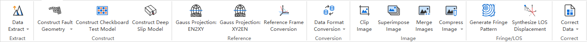

具体包括下列功能：

3.3.1 Data Extract（数据提取）
~~~~~~~~~~~~~~~~~~

    Data Extract（数据提取）菜单包括了：Extract Elevation Data（提取高程数据）、Extract Incidence/Azimuth Angle（提取入射角/方位角）、Extract Fault Segment Parameters（提取断层段参数）等8个子菜单，如图所示。

    .. image:: ../images/menu_image/Tools/btnMenu_DataExtract.png
       :align: center

  1. Extract Elevation Data（提取高程数据）

    该功能通过DEM栅格数据和InSAR偏移量栅格数据提取范围内的高程点

     .. image:: ../images/menu_image/Tools/dailog_ExtractElevationData.png
        :align: center

    **使用步骤：**

    STEP 1：选择或输入DEM栅格数据和InSAR偏移量栅格数据路径

     .. image:: ../images/menu_image/Tools/dialog_ExtractElevationData2.png
        :align: center

    STEP 2：点击Extract（提取）按钮，弹出成功提示框后，再点击Export（输出）按钮即可导出结果

     .. image:: ../images/menu_image/Tools/result_ExtractElevationData1.png
        :align: center

  2. Extract Incidence/Azimuth Angle（提取入射角/方位角）

    该功能通过入射角栅格数据、方位角栅格数据、数据误差、InSAR数据提取范围内的提取入射角/方位角点数据

     .. image:: ../images/menu_image/Tools/dailog_IncidenceAzimuthAngle.png
        :align: center

    **使用步骤：**

    STEP 1：选择或输入Inc Angle（入射角）栅格数据、Azi Angle（方位角）栅格数据、Data Error（数据误差）文件、InSAR数据路径以及导出文件路径

     .. image:: ../images/menu_image/Tools/dialog_IncidenceAzimuthAngle2.png
        :align: center

    STEP 2：点击Extract（提取）按钮，弹出成功提示框后，即可保存结果

     .. image:: ../images/menu_image/Tools/result_IncidenceAzimuthAngle.png
        :align: center

  3. Extract Fault Segment Parameters（提取断层分段参数）

    该功能通过设置断层分段参数，提取图层中矢量数据对应的断层迹线数据。请注意，提取断层分段参数时只能设置一个倾角和宽度，因此在后续的构建断层几何模型时，需要在输出的*.flt文件中根据需求修改每个分段的倾角和宽度数据。

     .. image:: ../images/menu_image/Tools/dailog_ExtractFaultSegmentParameters.png
        :align: center

    **使用步骤：**

    STEP 1：添加目标断层的矢量文件到图层（*.shp）

     .. image:: ../images/menu_image/Tools/dailog_ExtractFaultSegmentParameters2.png
        :align: center

    STEP 2：打开提取断层分段参数的窗口，选择第一步添加的矢量文件作为输入，设置相应的高斯投影和断层几何参数，并设置好输出文件的路径和文件名

     .. image:: ../images/menu_image/Tools/dailog_ExtractFaultSegmentParameters3.png
        :align: center

    STEP 3：点击Extract（提取）按钮，弹出成功提示框后，即可保存结果

     .. image:: ../images/menu_image/Tools/result_ExtractFaultSegmentParameters.png
        :align: center

  #. Extract GNSS Coseismic Displacement（提取GNSS等震线位移）

    该功能通过设置时间范围提取GNSS等震线位移数据

     .. image:: ../images/menu_image/Tools/dailog_ExtractGNSSCoseismicDisplacement.png
        :align: center

    **使用步骤：**

    STEP 1：选择或输入GNSS时序数据（.tms）路径，输入合适的时间范围，DateTime1和DateTime2

    STEP 2：点击OK，即可计算输出结果：N±dN、E±dE、U±dU，再点击Export即可导出计算结果

     .. image:: ../images/menu_image/Tools/dialog_ExtractGNSSCoseismicDisplacement2.png
        :align: center

  #. Extract Leveling Data within Block（提取范围内的水准数据）

     该功能用于提取多边形范围内的水准数据

     .. image:: ../images/menu_image/Tools/dailog_ExtractLevelingDatawithinBlock.png
        :align: center

    **使用步骤：**

    STEP 1：先通过Map View工具栏中的Create Polygon（新建多边形）工具绘制一个多边形范围

     .. image:: ../images/menu_image/Tools/tool_CreatePolygon.png
        :align: center

    STEP 2：点击按钮打开Extract Leveling Data within Block对话框，设置待提取的基础水准数据（.lev）路径和提取后数据的保存路径，选择之前绘制的多边形范围，点击Extract（提取）按钮，弹出成功提示框后，即可保存结果

     .. image:: ../images/menu_image/Tools/dialog_ExtractLevelingDataWithBlock2.png
        :align: center

  #. Extract GNSS Data within Block（提取范围内的GNSS数据）

      该功能用于提取多边形范围内的GNSS数据

     .. image:: ../images/menu_image/Tools/dailog_ExtractGNSSDatawithinBlock.png
        :align: center

    **使用步骤：**

    STEP 1：先通过Map View工具栏中的Create Polygon（新建多边形）工具绘制一个多边形范围

     .. image:: ../images/menu_image/Tools/tool_CreatePolygon.png
        :align: center

    STEP 2：点击按钮打开Extract GNSS Data within Block对话框，设置待提取的基础GNSS数据（.gps）路径和提取后数据的保存路径，选择之前绘制的多边形范围，点击Extract（提取）按钮，弹出成功提示框后，即可保存结果

     .. image:: ../images/menu_image/Tools/dialog_ExtractGNSSWithinBlock2.png
        :align: center

  #. Extract InSAR Data within Block（提取范围内的InSar数据）

      该功能用于提取多边形范围内的InSar数据

     .. image:: ../images/menu_image/Tools/dailog_ExtractInSARDatawithinBlock.png
        :align: center

    **使用步骤：**

    STEP 1：先通过Map View工具栏中的Create Polygon（新建多边形）工具绘制一个多边形范围

     .. image:: ../images/menu_image/Tools/tool_CreatePolygon.png
        :align: center

    STEP 2：点击按钮打开Extract InSAR Data within Block对话框，设置待提取的基础InSAR数据（.sar）路径和提取后数据的保存路径，选择之前绘制的多边形范围，点击Extract（提取）按钮，弹出成功提示框后，即可保存结果

     .. image:: ../images/menu_image/Tools/dialog_ExtractInSARDataWithinBlock2.png
        :align: center

  #. Extract Earthquakes within Block（提取范围内的地震数据）

      该功能用于提取多边形范围内的地震数据

     .. image:: ../images/menu_image/Tools/dailog_ExtractEarthquakeswithinBlock.png
        :align: center

    **使用步骤：**

    STEP 1：先通过Map View工具栏中的Create Polygon（新建多边形）工具绘制一个多边形范围

     .. image:: ../images/menu_image/Tools/tool_CreatePolygon.png
        :align: center

    STEP 2：点击按钮打开Extract Earthquakes within Block对话框，设置待提取的基础地震数据（.etc）路径和提取后数据的保存路径，选择之前绘制的多边形范围，点击Extract（提取）按钮，弹出成功提示框后，即可保存结果

     .. image:: ../images/menu_image/Tools/dialog_ExtractEarthquakesWithinBlock2.png
        :align: center

3.3.2 Construct 3D Geometry Faults（构造断层3D几何模型）
~~~~~~~~~~~~~~~~~~

    该功能可根据断层分段参数数据构建矩形或三角位错模型并输出相应的模型数据文件（同时会输出一个相应的断层分段行列数文件），可以构建的模型包含变走向角、变倾角、多个分支断层等各种复杂模型。具体参数设置如下图，主要包含输入文件、高斯投影参数、矩形网格大小、是否选用三角网格这些数据和参数设置。

    .. image:: ../images/menu_image/Tools/btnMenu_ConstructFaultGeometry.png
       :align: center

    
    **使用步骤：**

    STEP 1：选择提前准备好的断层参数文件（*.flt，通过断层参数提取并根据实际需求调整）

    STEP 2：根据数据依次配置相应参数
      * Reference Ellipsoid（参考椭球体）
      * L0（中央子午线，即数据经度范围的中点）
      * Length和Hight矩形错位patch的长度和高度尺寸
      * Triangle勾选表示采用三角网格，否则即为矩形网格

    STEP 3：点击Construct进行模型构建，并生成模型图片

    STEP 4：点击Export（导出）按钮，选择输出文件的路径并设置文件名，然后确认即可保存结果

(#) 构建矩形网格模型：

      构建矩形网格模型的参数配置文件、模型及其输出数据格式如下：

      .. image:: ../images/menu_image/Tools/dailog_ConstructRecFaultGeoModel.png
         :align: center

      在较为复杂的模型构建时，矩形网格划分明显存在一些空区（gap）或者重叠区域（overlap），此时需要更进一步采用三角网格划分，来消除gap和overlap使模型衔接连续

      .. image:: ../images/menu_image/Tools/result_ConstructRecFaultGeoModel.png
         :align: center  

(#) 构建三角网格模型：

      构建矩形网格模型的参数配置文件、模型及其输出数据格式如下：

      .. image:: ../images/menu_image/Tools/dailog_ConstructTriFaultGeoModel.png
         :align: center

      对比矩形网格模型，很明显消除了gap和overlap

      .. image:: ../images/menu_image/Tools/result_ConstructTriFaultGeoModel.png
          :align: center

(#) 构建多个分支断层模型：

      构建多个分支断层三角网格模型的参数配置文件、模型及其输出数据格式如下：

      .. image:: ../images/menu_image/Tools/dailog_ConstructMultiBranchFaultGeoModel.png
         :align: center

      .. image:: ../images/menu_image/Tools/result_ConstructMultiBranchFaultGeoModel.png
          :align: center

3.3.3 Construct Checkboard Test Model（构造棋盘测试模型）
~~~~~~~~~~~~~~~~~~

    该功能可基于断层几何模型根据用户设定尺寸生成构造棋盘测试模型

    .. image:: ../images/menu_image/Tools/CreateCheckboardTestModel.png
       :align: center

    **使用步骤：**

    STEP 1：先输入或选择 Fault Geometry Model File（断层几何模型文件）

    STEP 2：根据数据依次配置相应参数
      * Chess Size的Row和Col（象棋尺寸所占的行和列）
      * Fault Plane Grid的Row和Col（断层屏幕格网所占行和列）
      * Sliding Amount（浮动总数）中Strike-slip Component（走滑分量）、Tilt Component（倾斜分量）、Split Component（断裂分量）

    STEP 3：点击Construct进行构建，点击Export（导出）按钮，弹出成功提示框后，即可保存结果

3.3.4 Construct Deep Slip Model（构造深部滑移模型）
~~~~~~~~~~~~~~~~~~

    该功能可基于断层几何模型生成深部滑移模型

    .. image:: ../images/menu_image/Tools/dailog_ConstructDeepSlipModel.png
       :align: center

    **使用步骤：**

    STEP 1：输入或选择 Fault Geometry Model File（断层几何模型文件）

    STEP 2：输入或选择 Longterm Slip Model File（长期滑移模型文件）

    STEP 3：输入或选择 Negative Slip Model File（负滑移模型文件）

    STEP 4：点击Construct进行构建，点击Export（导出）按钮，弹出成功提示框后，即可保存结果

3.3.5 Gauss Projection:EN2XY（高斯投影:经纬度转投影坐标）
~~~~~~~~~~~~~~~~~~

    该功能用于将经纬度坐标转换为高斯投影坐标

1. 模式1
    
    .. image:: ../images/menu_image/Tools/dailog_GaussProjectionEN2XY.png
       :align: center

    **使用步骤：**

    STEP 1：输入Longitude（经度）、Latitude（纬度）、Zone Width（分带宽度）、Reference Ellipsoid（参考椭球体）

    STEP 2：点击OK，自动计算X、Y、Zone Num（带号）结果

3.3.6 Gauss Projection:XY2EN（高斯投影:投影坐标转经纬度）
~~~~~~~~~~~~~~~~~~

    该功能用于将高斯投影坐标转换为经纬度坐标

1. 模式1

    .. image:: ../images/menu_image/Tools/dailog_GaussProjectionXY2EN.png
       :align: center

    **使用步骤：**

    STEP 1：输入X、Y、Zone Num（带号）、Reference Ellipsoid（参考椭球体）

    STEP 2：点击OK，自动计算Longitude（经度）、Latitude（纬度）、Zone Width（分带宽度）结果

3.3.7 Reference Frame Conversion（参考框架转换）
~~~~~~~~~~~~~~~~~~

    该功能用于进行数据参考框架的转换

    .. image:: ../images/menu_image/Tools/dailog_ReferenceFrameConversion.png
       :align: center

    **使用步骤：**

    STEP 1：输入或选择GNSS数据的路径

    STEP 2：输入Euler Vector（欧拉向量）

    STEP 3：输入Earth Radius（地球半径）、Reverse（反向）

    STEP 4：点击Translation（转换）进行计算，点击Export（导出）按钮，弹出成功提示框后，即可保存结果

    **相关知识：Coordinate Systems (坐标系统)**

    软件使用的地理坐标系统（Geographic Coordinate System）为World Geodetic System 1984（简称WGS84），其EPSG编码为4326。

    软件使用的投影坐标系统（Projected Coordinate System）为高斯克吕格投影（Gauss-Kruger projection）。

    在加载数据时，如果数据本身带有坐标系统，软件会采用动态投影自动转换至当前坐标系统下，也可采用系统提供的坐标转换工具进行转换，如：`Gauss Projection:EN2XY（高斯投影:经纬度转投影坐标） <https://qtgahelpdoc.readthedocs.io/en/latest/3%20Function%20%28%E5%8A%9F%E8%83%BD%E4%BB%8B%E7%BB%8D%29.html#gauss-projection-en2xy>`_、`Gauss Projection:XY2EN（高斯投影:投影坐标转经纬度） <https://qtgahelpdoc.readthedocs.io/en/latest/3%20Function%20%28%E5%8A%9F%E8%83%BD%E4%BB%8B%E7%BB%8D%29.html#gauss-projection-xy2en>`_ 和 `Reference Frame Conversion（参考框架转换） <https://qtgahelpdoc.readthedocs.io/en/latest/3%20Function%20%28%E5%8A%9F%E8%83%BD%E4%BB%8B%E7%BB%8D%29.html#reference-frame-conversion>`_。

3.3.8 Data Format Conversion（数据格式转换）
~~~~~~~~~~~~~~~~~~

    该功能用于进行栅格或矢量格式的转换

    .. image:: ../images/menu_image/Tools/btnMenu_DataFormatConversion.png
       :align: center

1. BIN -> IMG（二进制转IMG）
    该功能用于将二进制数据转换为IMG格式数据，输入数据为二进制数据文件和对应的头文件，输出数据为IMG格式数据（注：勾选Diplopia data选项表示二进制数据为复视数据）

    .. image:: ../images/menu_image/Tools/dialog_BIN2IMG.png
       :align: center
    
2. IMG -> BIN（IMG转二进制）
    该功能用于将IMG格式数据转换为二进制数据，输入数据为IMG格式数据，输出数据为二进制数据文件和对应的头文件。

    .. image:: ../images/menu_image/Tools/dialog_IMG2BIN.png
       :align: center

3. POS -> TMS（POS转GNSS时序数据）
    该功能用于将POS格式数据转换为GNSS时序数据，输入数据为POS格式数据，输出数据为GNSS时序数据。

    .. image:: ../images/menu_image/Tools/dialog_POS2TMS.png
       :align: center

4. NLL -> SHP（NLL转SHP）
    该功能用于将NLL格式数据转换为SHP格式数据，输入数据为NLL格式数据，输出数据为SHP格式数据。

    .. image:: ../images/menu_image/Tools/dialog_NLL2SHP.png
       :align: center

5. LEV -> SHP（水准转SHP）
    该功能用于将LEV水准数据转换为SHP格式数据，输入数据为LEV水准数据，输出数据为SHP格式数据。

    .. image:: ../images/menu_image/Tools/dialog_LEV2SHP.png
       :align: center

6. GPS -> SHP（GPS转SHP）
    该功能用于将GPS数据转换为SHP格式数据，输入数据为GPS数据，输出数据为SHP格式数据。

    .. image:: ../images/menu_image/Tools/dialog_GPS2SHP.png
       :align: center

7. ETC -> SHP（地震转SHP）
    该功能用于将ETC地震目录数据转换为SHP格式数据，输入数据为ETC地震目录数据，输出数据为SHP格式数据。

    .. image:: ../images/menu_image/Tools/dialog_ETC2SHP.png
       :align: center

8. SAR -> SHP（InSAR转SHP）
    该功能用于将InSAR数据转换为SHP格式数据，输入数据为InSAR数据，输出数据为SHP格式数据。

    .. image:: ../images/menu_image/Tools/dialog_SAR2SHP.png
       :align: center

3.3.9 Clip Image（图像裁切）
~~~~~~~~~~~~~~~~~~

    该功能基于绘制范围进行栅格图像的裁切

    .. image:: ../images/menu_image/Tools/dialog_ClipImage.png
       :align: center

    STEP 1：先通过Map View工具栏中的Create Polygon（新建多边形）工具绘制一个多边形范围

     .. image:: ../images/menu_image/Tools/tool_CreatePolygon.png
        :align: center

    STEP 2：添加栅格图像

    STEP 3：添加导出图像路径

    STEP 4：点击RUN（运行）进行计算，即可保存结果

3.3.10 Superimpose Image（图像叠加）
~~~~~~~~~~~~~~~~~~
    该功能用于将2个图像进行像元叠加运算处理

    .. image:: ../images/menu_image/Tools/dialog_SuperimposeImage.png
       :align: center

    STEP 1：选择两幅需要叠加处理的图像

    STEP 2：设置输出图像的路径

    STEP 3：选择叠加方式（Plus为加运算，Minus为减运算）

    STEP 4：点击OK进行计算，即可保存结果

3.3.11 Merge Image（图像合并）
~~~~~~~~~~~~~~~~~~
    该功能用于将多个图像进行合并处理

    .. image:: ../images/menu_image/Tools/dialog_MergeImages.png
       :align: center

    STEP 1：通过列表添加需要合并的图形

    STEP 2：设置输出图像的路径

    STEP 3：点击RUN（运行）进行计算，即可保存结果

3.3.12 Compress Image（图像压缩）
~~~~~~~~~~~~~~~~~~

    .. image:: ../images/menu_image/Tools/btnMenu_CompressImage.png
       :align: center

1. Uniform Downsampling （均匀采样压缩）

    .. image:: ../images/menu_image/Tools/dialog_UniformDownsampling.png
       :align: center

2. Uniform Downsampling （四叉树采样压缩）

    .. image:: ../images/menu_image/Tools/dialog_QuadtreeDownsampling.png
       :align: center

3.3.13 Generate Fringe Pattern（生成干涉条纹）
~~~~~~~~~~~~~~~~~~

    .. image:: ../images/menu_image/Tools/dialog_GenerateFringePattern.png
       :align: center

3.3.14 Synthesize LOS Displacement（合成LOS位移）
~~~~~~~~~~~~~~~~~~

    .. image:: ../images/menu_image/Tools/dialog_SynthesizeLOSDisplacement.png
       :align: center

3.3.15 Correct Data（数据校正）
~~~~~~~~~~~~~~~~~~

    .. image:: ../images/menu_image/Tools/btnMenu_CorrectData.png
       :align: center

1. Correct Raster Data （校正遥感数据）
    该功能用于遥感数据进行校正修复

    .. image:: ../images/menu_image/Tools/dialog_CorrectRasterData.png
       :align: center

2. Correct Downsampled LOS Displacement （校正降采样LOS位移数据）
    该功能用于降采样LOS位移数据进行校正修复

    .. image:: ../images/menu_image/Tools/dialog_CorrectDownsampledLOSDisplacement.png
       :align: center

3.4 Analysis (分析)
---------------------

Analysis (分析)菜单主要包括Calculate Min/Max Values（同震地表位移）、Coseismic Stress Change（同震应力变化）、Coseismic Stress Change on Fault（断层上的同震应力变化）等8项功能，如图所示。

3.4.1 Calculate Min/Max Values（计算最大最小值）
~~~~~~~~~~~~~~~~~~
该功能用于统计库伦应力数据、GNSS数据、SAR数据的最大最小值 

    .. image:: ../images/menu_image/Analysis/minmax.png
        :align: center  

3.4.2 Calculate Total Seismic Moment（计算总地震力矩）
~~~~~~~~~~~~~~~~~~
该功能用于总地震力矩

    .. image:: ../images/menu_image/Analysis/dialog_CalculateTotalSeismicMoment.png
        :align: center  

    STEP 1：先输入Fault geometry model File（断层几何模型文件.tri .rec .flt）和Earthquake recurrence interval File（地震重复间隔文件.eri）

    STEP 2：设置Reference Ellipsoid（参考椭球）、L0（研究区中央经线）、Current Time（当前时间）
      * Reference Ellipsoid（参考椭球），可设置为WGS-84（默认）、Krassovsky Ellipsoid、International Ellipsoid 1975椭球
      * L0（研究区中央经线），设置范围为0.00-360
      * Current Time（当前时间），设计研究对应时间

    STEP 3：点击Calculate（计算）按钮即可得到总地震力矩结果

     .. image:: ../images/menu_image/Analysis/result_CalculateTotalSeismicMoment.png
        :align: center

3.4.3 Compare GNSS/InSAR Displacement（比较GNSS/InSAR位移）
~~~~~~~~~~~~~~~~~~
Compare GNSS/InSAR Displacement，该菜单界面如下： 

.. image:: ../images/menu_image/Analysis/CompareGNSSInSARDisplacement.png
    :align: center  

3.4.4 Estimate Observation Standard Deviation（估计观测标准差）
~~~~~~~~~~~~~~~~~~

3.4.5 Correlation between（相关性分析）
~~~~~~~~~~~~~~~~~~

3.4.6 Fit Interseismic GNSS Time Series（震间GNSS时间序列拟合）
~~~~~~~~~~~~~~~~~~
Fit Interseismic GNSS Time Series，该菜单界面如下： 

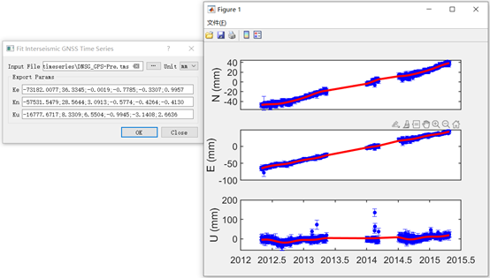

3.4.7 Fit Postseimic GNSS Time Series（震后GNSS时间序列拟合）
~~~~~~~~~~~~~~~~~~
Fit Postseimic GNSS Time Series，该菜单界面如下：

3.4.8 Fit Temporal Distribution Of Aftershocks （余震时间分布拟合）
~~~~~~~~~~~~~~~~~~
Fit Temporal Distribution Of Aftershocks，该菜单界面如下：

    .. image:: ../images/menu_image/Analysis/FitTemporalDistributionOfAftershocks.png
       :align: center 

3.4.9 Fit GNSS Velocities（GNSS速度拟合）
~~~~~~~~~~~~~~~~~~

3.4.10 Correct Postseimic GNSS Time Series（震间GNSS时间序列修正）
~~~~~~~~~~~~~~~~~~
Correct Postseimic GNSS Time Series，该菜单界面如下：

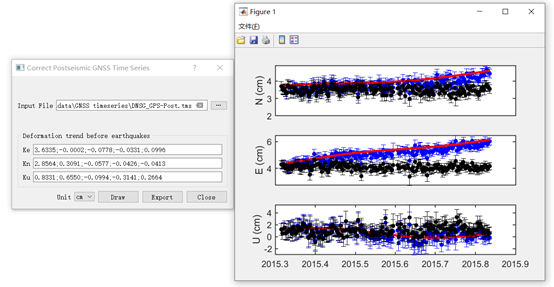

3.5 Forward (正演)
-------------------

3.5.1 Coseismic Surface Displacement（同震地表位移）
~~~~~~~~~~~~~~~~~~

3.5.2 Coseismic Stress Change（同震应力变化）
~~~~~~~~~~~~~~~~~~

3.5.3 Coseismic Stress Change on Fault（断层上的同震应力变化）
~~~~~~~~~~~~~~~~~~

3.5.4 Postseismic Stress Change（震后应力变化）
~~~~~~~~~~~~~~~~~~

3.5.5 Postseismic Surface Displacement（震后地表位移）
~~~~~~~~~~~~~~~~~~

3.5.6 Interseismic Surface Displacement（震间地表位移）
~~~~~~~~~~~~~~~~~~

3.5.7 Fault Stress Accumulation Rate（断层应力累积率）
~~~~~~~~~~~~~~~~~~

3.5.8 Green's Function for a Multi-layered Half-space（多层半空间的格林函数）
~~~~~~~~~~~~~~~~~~

3.6 Invert (反演)
------------------

3.6.1 Fault Geometry（断层几何形状）
~~~~~~~~~~~~~~~~~~

3.6.2 Fault Slip Distribution（断层滑动分布）
~~~~~~~~~~~~~~~~~~

3.6.4 Fault Geometry and Slip（断层几何形状与滑动）
~~~~~~~~~~~~~~~~~~

3.6.5 Crust Motion and Strain（地壳运动与应变）
~~~~~~~~~~~~~~~~~~

3.6.6 Fault Interseismic Coupling（断层震间耦合）
~~~~~~~~~~~~~~~~~~

3.7 Evaluate (评估)
--------------------

Evaluate菜单包括下列功能：

(1) Count Seismic Moment
(#) Ocurrence Possibility
(#) After shock Duration
(#) Assess Earthquake OccurTime
(#) Stress Disturb Time

3.8 Cartography (制图)
---------------
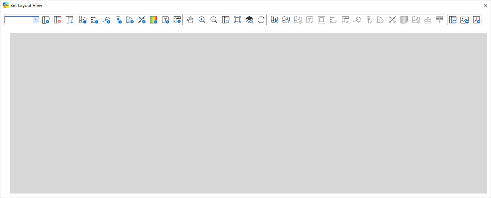
功能说明：

    * |Layout List| Layout List（布局列表）下拉列表：该下拉列表用于显示当前布局视图，点击该下拉列表后，可切换所需的布局。
    * |New Layout| New Layout（新建布局）按钮：点击该按钮后，会弹出New Print Layout（新建打印布局）对话框，要求输入新的唯一布局标题，点击确定后即可生成新布局。
    * |Delete Layout| Delete Layout（删除布局）按钮：点击该按钮后，可删除当前布局。
    * |Save Layout| Save Layout（保存布局）按钮：点击该按钮后，可保存布局的当前状态。
    * |Add Map| Add Map（添加地图）按钮：点击该按钮后，可在当前布局中添加一个新的地图框。
    * |Add Legend| Add Legend（添加图例）按钮：点击该按钮后，可在当前布局中添加一个新的图例。
    * |Add GNSS Legend| Add GNSS Legend（添加GNSS图例）按钮：点击该按钮后，可在当前布局中添加一个新的GNSS图例。
    * |Add Lev Legend| Add Lev Legend（添加水准图例）按钮：点击该按钮后，可在当前布局中添加一个新的水准图例。
    * |Add Rotation Rate Legend| Add Rotation Rate Legend（添加旋转率图例）按钮：点击该按钮后，可在当前布局中添加一个新的旋转率图例。
    * |Add Principal Strain Rate Legend| Add Principal Strain Rate Legend（添加主应变率图例）按钮：点击该按钮后，可在当前布局中添加一个新的主应变率图例。
    * |Add Color Ramp| Add Color Ramp（添加色带）按钮：点击该按钮后，可在当前布局中添加一个新的色带。
    * |Add Label| Add Label（添加标签）按钮：点击该按钮后，可在当前布局中添加一个新的文字标签。
    * |Add Scale Bar| Add Scale Bar（添加比例尺）按钮：点击该按钮后，可在当前布局中添加一个新的比例尺。
    * |Pan| Pan（平移）按钮：点击该按钮后，可通过鼠标平移当前布局视图。
    * |Zoom In| Zoom In（放大）按钮：点击该按钮后，可放大当前布局视图。
    * |Zoom Out| Zoom Out（缩小）按钮：点击该按钮后，可缩小当前布局视图。
    * |Zoom| Zoom（缩放）按钮：点击该按钮后，可通过鼠标控制缩放当前布局视图。
    * |Zoom Actual| Zoom Actual（缩放实际）按钮：点击该按钮后，可缩放当前布局视图到实际位置。
    * |Zoom All| Zoom All（缩放全部）按钮：点击该按钮后，可缩放当前布局视图到包含全部内容。
    * |Refresh| Refresh（刷新）按钮：点击该按钮后，可刷新当前布局视图。
    * |Select/Move Item| Select/Move Item（选择/移动图面要素）按钮：点击该按钮后，可将鼠标切换至选择状态，用于选择图例或图面要素。并可按住鼠标左键拖动图例或图面要素至合适位置。
    * |Move Content| Move Content（移动内容）按钮：点击该按钮后，可操作地图框内的视图范围，移动地图框内的显示内容。
    * |Overview Setting| Overview Setting（缩略图设置）按钮：当布局视图内有2个及以上地图框时，选中一个地图框后，点击该按钮后可将该地图框地图视图设置到全图范围
    * |Grid Setting| Grid Setting（网格设置）按钮：该按钮用于设置地图框相关参数，具体设置参数请参阅 `3.8.1 Grid Setting（网格设置）`_。
    * |Text Setting| Text Setting（文本设置）按钮：该按钮用于设置标签的文本属性，具体设置参数请参阅 `3.8.2 Text Setting（文本设置）`_。
    * |Legend Setting| Legend Setting（图例设置）按钮：该按钮用于设置图例相关参数，具体设置参数请参阅 `3.8.3 Legend Setting（图例设置）`_。
    * |Scalebar Setting| Scalebar Setting（比例尺设置）按钮：该按钮用于设置比例尺相关参数，具体设置参数请参阅 `3.8.4 Scalebar Setting（比例尺设置）`_。
    * |GNSS Setting| GNSS Setting（GNSS图例设置）按钮：该按钮用于设置GNSS图例相关参数，具体设置参数请参阅 `3.8.5 GNSS Setting（GNSS图例设置）`_。
    * |Lev Setting| Lev Setting（水准图例设置）按钮：该按钮用于设置水准图例相关参数，具体设置参数请参阅 `3.8.6 Lev Setting（水准图例设置）`_。
    * |Rotation Rate Setting| Rotation Rate Setting（旋转率图例设置）按钮：该按钮用于设置旋转率图例相关参数，具体设置参数请参阅 `3.8.7 Rotation Rate Setting（旋转率图例设置）`_。
    * |Principal Strain Rate Setting| Principal Strain Rate Setting（主应变率图例设置）按钮：该按钮用于设置主应变率图例相关参数，具体设置参数请参阅 `3.8.8 Principal Strain Rate Setting（主应变率图例设置）`_。
    * |Color Ramp Setting| Color Ramp Setting（色带设置）按钮：该按钮用于设置色带相关参数，具体设置参数请参阅 `3.8.9 Color Ramp Setting（色带设置）`_。
    * |Delete Item| Delete Item（删除部件）按钮：该按钮用于删除当前布局视图内被选中的图饰部件
    * |Raise Select Items| Raise Select Items（提升选择部件）按钮：当图饰部件出现压盖时，该按钮用于提升当前布局视图内被选中的部件的图层顺序
    * |Lower Select Items| Lower Select Items（降低选择部件）按钮：当图饰部件出现压盖时，该按钮用于降低当前布局视图内被选中的部件的图层顺序
    * |Print| Print（打印）按钮：该按钮用于打开打印控制对话框，选择合适的打印机及其设置打印当前布局视图
    * |Export As Image| Export As Image（导出图片）按钮：该按钮用于打开图片保存对话框将当前布局视图导出为图片格式，支持.BMP、.JPG、.PNG、.TIF、Webp等图片格式
    * |Export As PDF| Export As PDF（导出PDF）按钮：该按钮用于打开PDF保存对话框将当前布局视图导出为PDF格式
    
    
    .. |Layout List|      image:: ../images/menu_image/File/select_Layout.png
    .. |New Layout|       image:: ../images/menu_image/File/btn_newLayout.png
    .. |Delete Layout|    image:: ../images/menu_image/File/btn_deleteLayout.png
    .. |Save Layout|      image:: ../images/menu_image/File/btn_saveLayout.png
    .. |Add Map|          image:: ../images/menu_image/File/btn_addMap.png
    .. |Add Legend|       image:: ../images/menu_image/File/btn_addLegend.png
    .. |Add GNSS Legend|  image:: ../images/menu_image/File/btn_addGNSSLegend.png
    .. |Add Lev Legend|   image:: ../images/menu_image/File/btn_addLevLegend.png
    .. |Add Rotation Rate Legend|   image:: ../images/menu_image/File/btn_addRotationRateLegend.png
    .. |Add Principal Strain Rate Legend|   image:: ../images/menu_image/File/btn_addPrincipalStrainLegend.png
    .. |Add Color Ramp|   image:: ../images/menu_image/File/btn_addColorRamp.png
    .. |Add Label|        image:: ../images/menu_image/File/btn_addLabel.png
    .. |Add Scale Bar|    image:: ../images/menu_image/File/btn_addScaleBar.png
    .. |Pan|              image:: ../images/menu_image/File/btn_pan.png
    .. |Zoom In|          image:: ../images/menu_image/File/btn_zoomIn.png
    .. |Zoom Out|         image:: ../images/menu_image/File/btn_zoomOut.png
    .. |Zoom|             image:: ../images/menu_image/File/btn_zoom.png
    .. |Zoom Actual|      image:: ../images/menu_image/File/btn_zoomActual.png
    .. |Zoom All|         image:: ../images/menu_image/File/btn_zoomAll.png
    .. |Refresh|          image:: ../images/menu_image/File/btn_refresh.png
    .. |Select/Move Item| image:: ../images/menu_image/File/btn_selectMoveItem.png
    .. |Move Content|     image:: ../images/menu_image/File/btn_moveContent.png
    .. |Grid Setting|     image:: ../images/menu_image/File/btn_gridSetting.png
    .. |Text Setting|     image:: ../images/menu_image/File/btn_textSetting.png
    .. |Overview Setting| image:: ../images/menu_image/File/btn_overviewSetting.png
    .. |Legend Setting|   image:: ../images/menu_image/File/btn_legendSetting.png
    .. |Add Layer|        image:: ../images/menu_image/File/btn_add.png
    .. |Delete Layer|     image:: ../images/menu_image/File/btn_delete.png
    .. |Edit Layer Name|  image:: ../images/menu_image/File/btn_edit.png
    .. |Scalebar Setting| image:: ../images/menu_image/File/btn_scalebarSetting.png
    .. |GNSS Setting|     image:: ../images/menu_image/File/btn_GNSSSetting.png
    .. |Lev Setting|      image:: ../images/menu_image/File/btn_levSetting.png
    .. |Rotation Rate Setting|    image:: ../images/menu_image/File/btn_RotationRateSetting.png
    .. |Principal Strain Rate Setting|    image:: ../images/menu_image/File/btn_PrincipalStrainRateSetting.png
    .. |Color Ramp Setting|       image:: ../images/menu_image/File/btn_ColorRampSetting.png
    .. |Delete Item|      image:: ../images/menu_image/File/btn_DeleteItem.png
    .. |Raise Select Items|       image:: ../images/menu_image/File/btn_RaiseSelectItems.png
    .. |Lower Select Items|       image:: ../images/menu_image/File/btn_LowerSelectItems.png
    .. |Print|            image:: ../images/menu_image/File/btn_Print.png
    .. |Export As Image|  image:: ../images/menu_image/File/btn_ExportAsImage.png
    .. |Export As PDF|    image:: ../images/menu_image/File/btn_ExportAsPDF.png
    
3.8.1 Grid Setting（网格设置）
~~~~~~~~~~~~~~~~~~
(1) 选择地图框，如果没有请点击 |Add Map| Add Map（添加地图）按钮添加地图框，激活Grid Setting（网格设置）按钮
(#) 点击该按钮，弹出Map Item Setting对话框，如下图所示：

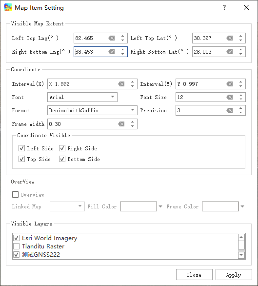

参数说明：
      * Left Top Lng（左上经度）、Right Bottom Lng（右下经度）、Left Top Lat（左上纬度）、Right Bottom Lat（右下纬度）用于设置地图视图的经纬度范围
      * Interval X（X方向间隔）、Interval Y（Y方向间隔）用于设置坐标轴的刻度间隔
      * Font（字体）、Font Size（字号）、Format（格式）、Precision（有效位数）用于设置坐标刻度值的文字样式
      * Frame Width（边框宽度）用于设置地图框的边框宽度
      * Coordinate Visible中的Left Side、Right Side、Top Side、Bottom Side用于设置边框上下左右是否显示
      * OverView（缩略图）只有在Layout View（布局视图）内有2个及以上地图框时才会激活，Linked Map（连接地图）用于指定对应的缩略图地图框，Fill Color（填充色）和Frame Color（边框颜色）用于设置缩略图中对应地图范围的填充色和边框的颜色
      * Visible Layers（显示图层）中会列出当前地图视图中应用的图层列表

(3) 根据出图需要设置完相关参数后，点击“Apply”按钮即可保存并预览设置效果

3.8.2 Text Setting（文本设置）
~~~~~~~~~~~~~~~~~~
(1) 选择一个文本标签，如果没有请点击 |Add Label| Add Label（添加标签）按钮添加一个文本标签，激活Text Setting（文本设置）按钮
(2) 点击该按钮，弹出Label Edit对话框，如下图所示：

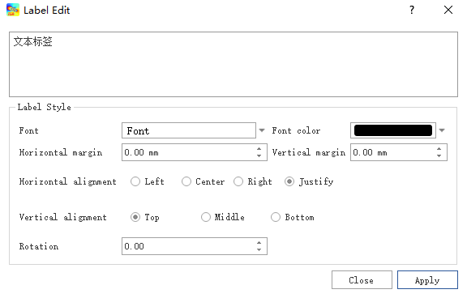
    
参数说明：
      * Font（字体）、Font Color（字体颜色）用于设置标签文字的字号、字体、颜色等效果
      * Horizontal Margin（水平边距）、Vertical Margin（垂直边距）用于设置文本与标签框之间在水平方向和垂直方向上的距离
      * Horizontal Alignment（水平对齐）、Vertical Alignment（垂直对齐）用于设置文本在标签框内的对齐方式
      * Rotation（旋转）用于设置文本的旋转角度
(3) 根据需要设置完相关参数后，点击“Apply”按钮即可保存并预览设置效果

3.8.3 Legend Setting（图例设置）
~~~~~~~~~~~~~~~~~~
(1) 选择一个图例，如果没有请点击 |Add Legend| Add Legend（添加图例）按钮添加一个图例，激活Legend Setting（图例设置）按钮
(2) 点击该按钮，弹出Legend Setting对话框，如下图所示：

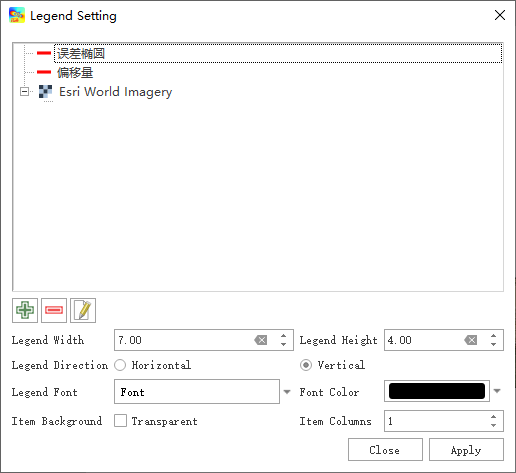
    
参数说明：
      * 点击图层列表下方的 |Add Layer| “+”号按钮可以添加视图中未加入的图层， |Delete Layer| “-”号按钮可以删除视图中不需要的图层， |Edit Layer Name| 编辑按钮可以编辑图层名称
      * Legend Width（图例宽度）、Legend Height（图例高度）用于设置整个图例的宽度和高度
      * Legend Direction（图例方向）用于设置图例中项目的排列方向为横向或纵向
      * Legend Font（图例字体）、Font Color（字体颜色）用于设置图例中文本的字体、字号、颜色等样式
      * Item Background（背景色）如果勾选Transparent则图例背景透明，否则为白色背景
      * Item Columns（项目）用于设置图例中条目排列的列数
(3) 根据需要设置完相关参数后，点击“Apply”按钮即可保存并预览设置效果

3.8.4 Scalebar Setting（比例尺设置）
~~~~~~~~~~~~~~~~~~
(1) 选择一个比例尺，如果没有请点击 |Add Scale Bar| Add Scale Bar（添加比例尺）按钮添加一个比例尺，激活Scalebar Setting（比例尺设置）按钮
(2) 点击该按钮，弹出Scalebar Setting对话框，如下图所示：

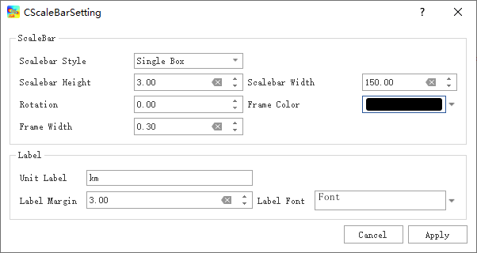
    
参数说明：
      * Scalebar Style（比例尺样式）用于设置比例尺的显示样式，可选包括Single Box（单盒式）、Double Box（双盒式）、Line Ticks Middle（中线段式）、Line Ticks Down（下线段式）、Line Ticks Up（上线段式）、Stepped Line（折线式）、Hollow（空心式）、Numeric（数字式）
      * Scalebar Height（比例尺高度）、Scalebar Width（比例尺宽度）用于设置比例尺高宽
      * Rotation（角度）用于设置比例尺旋转角度
      * Frame Width（边框宽度）用于设置比例尺边框宽度
      * Unit Label（单位标签）用于设置比例尺显示的标签单位，默认为km
      * Label Margin（标签间距）用于设置标签与比例尺之间的距离
      * Label Font（标签字体）用于设置比例尺标签的字体、字号、颜色等样式
(3) 根据需要设置完相关参数后，点击“Apply”按钮即可保存并预览设置效果

3.8.5 GNSS Setting（GNSS图例设置）
~~~~~~~~~~~~~~~~~~
(1) 选择一个GNSS图例，如果没有请点击 |Add GNSS Legend| Add GNSS Legend（添加GNSS图例）按钮添加一个GNSS图例，激活GNSS Setting（GNSS图例设置）按钮
(2) 点击该按钮，弹出GNSS Setting对话框，如下图所示：

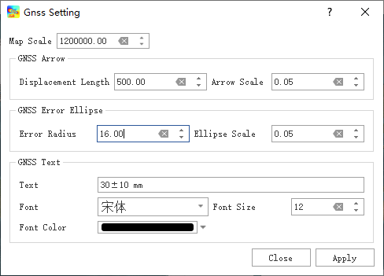
    
参数说明：
      * Map Scale（地图比例尺）用于设置图例采用的地图比例尺，默认为布局视图中当前的地图比例尺
      * Displacement Length（位移长度）用于设置图例中GNSS Arrow（GNSS箭头）的位移长度尺寸
      * Arrow Scale（箭头比例）用于设置图例中GNSS Arrow（GNSS箭头）的箭头比例大小
      * Error Radius（误差半径）用于设置图例中GNSS Error Ellipse（GNSS误差椭圆）的椭圆半径
      * Ellipse Scale（椭圆比例）用于设置图例中GNSS Error Ellipse（GNSS误差椭圆）中椭圆的比例
      * Text（文字）、Font（字体）、Font Size（字号）、Font Color（颜色）用于设置图例中GNSS Text（GNSS文字标注）的文字内容、字体字族、字号大小和文字颜色
(3) 根据需要设置完相关参数后，点击“Apply”按钮即可保存并预览设置效果

3.8.6 Lev Setting（水准图例设置）
~~~~~~~~~~~~~~~~~~
(1) 选择一个水准图例，如果没有请点击 |Add Lev Legend| Add Lev Legend（添加水准图例）按钮添加一个水准图例，激活Lev Setting（水准图例设置）按钮
(2) 点击该按钮，弹出Lev Setting对话框，如下图所示：

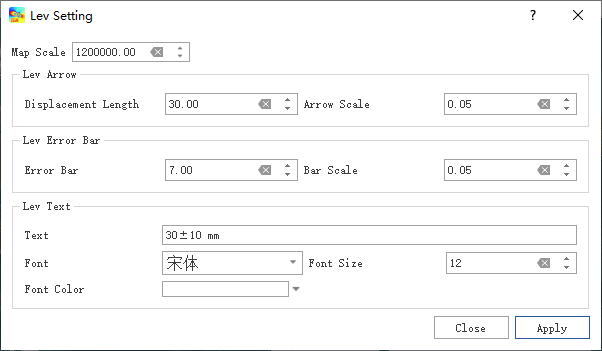
    
参数说明：
      * Map Scale（地图比例尺）用于设置图例采用的地图比例尺，默认为布局视图中当前的地图比例尺
      * Displacement Length（位移长度）用于设置图例中Lev Arrow（水准箭头）的位移长度尺寸
      * Arrow Scale（箭头比例）用于设置图例中Lev Arrow（水准箭头）的箭头比例大小
      * Error Radius（误差半径）用于设置图例中Lev Error Ellipse（水准误差椭圆）的椭圆半径
      * Ellipse Scale（椭圆比例）用于设置图例中Lev Error Ellipse（水准误差椭圆）中椭圆的比例
      * Text（文字）、Font（字体）、Font Size（字号）、Font Color（颜色）用于设置图例中Lev Text（Lev文字标注）的文字内容、字体字族、字号大小和文字颜色
(3) 根据需要设置完相关参数后，点击“Apply”按钮即可保存并预览设置效果

3.8.7 Rotation Rate Setting（旋转率图例设置）
~~~~~~~~~~~~~~~~~~
(1) 选择一个旋转率图例，如果没有请点击 |Add Rotation Rate Legend| Add Rotation Rate Legend（添加旋转率图例）按钮添加一个旋转率图例，激活|Rotation Rate Setting| Rotation Rate Setting（旋转率图例设置）按钮
(2) 点击该按钮，弹出Rotation Rate Setting对话框，如下图所示：

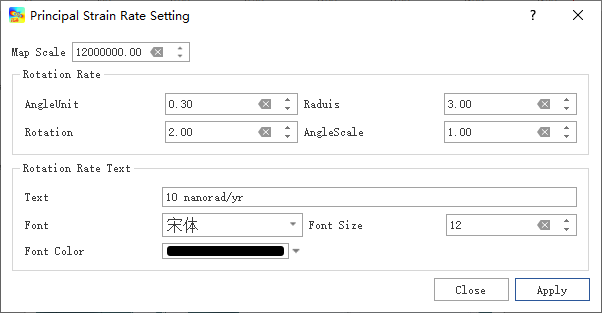
    
参数说明：
      * Map Scale（地图比例尺）用于设置图例采用的地图比例尺，默认为布局视图中当前的地图比例尺
      * AngleUnit（角度单位）用于设置Rotation Rate（旋转率）扇形的角度间隔（单位：弧度）
      * Raduis（半径）用于设置Rotation Rate（旋转率）扇形的半径（单位：弧度）
      * Rotation（旋转）用于设置Rotation Rate（旋转率）扇形的角度（单位：弧度）
      * AngleScale（角度比例）用于设置Rotation Rate（旋转率）扇形的缩放比例
      * Text（文字）、Font（字体）、Font Size（字号）、Font Color（颜色）用于设置图例中Rotation Rate Text（旋转率标注）的文字内容、字体字族、字号大小和文字颜色
(3) 根据需要设置完相关参数后，点击“Apply”按钮即可保存并预览设置效果

3.8.8 Principal Strain Rate Setting（主应变率图例设置）
~~~~~~~~~~~~~~~~~~
(1) 选择一个主应变率图例，如果没有请点击 |Add Principal Strain Rate Legend| Add Principal Strain Rate Legend（添加主应变率图例）按钮添加一个旋转率图例，激活|Principal Strain Rate Setting| Principal Strain Rate Setting（主应变率图例设置）按钮
(2) 点击该按钮，弹出Principal Strain Rate Setting对话框，如下图所示：

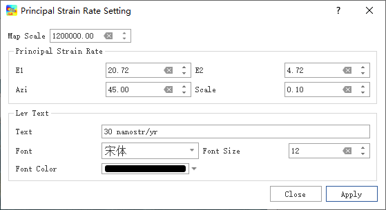
    
参数说明：
      * Map Scale（地图比例尺）用于设置图例采用的地图比例尺，默认为布局视图中当前的地图比例尺
      * E1用于设置Principal Strain Rate（主应变率）图例中的最大主应变方向的尺寸
      * E2用于设置Principal Strain Rate（主应变率）图例中的最小主应变方向的尺寸
      * Azi用于设置Principal Strain Rate（主应变率）图例中主应变方向的角度
      * Scale用于设置Principal Strain Rate（主应变率）图例的比例
      * Text（文字）、Font（字体）、Font Size（字号）、Font Color（颜色）用于设置图例中Principal Strain Rate（主应变率标注）的文字内容、字体字族、字号大小和文字颜色
(3) 根据需要设置完相关参数后，点击“Apply”按钮即可保存并预览设置效果

3.8.9 Color Ramp Setting（色带设置）
~~~~~~~~~~~~~~~~~~
(1) 选择一个色带，如果没有请点击 |Add Color Ramp| Add Color Ramp（添加色带）按钮添加一个色带图例，激活Color Ramp Setting（色带设置）按钮
(2) 点击该按钮，弹出Color Ramp Setting对话框，如下图所示：

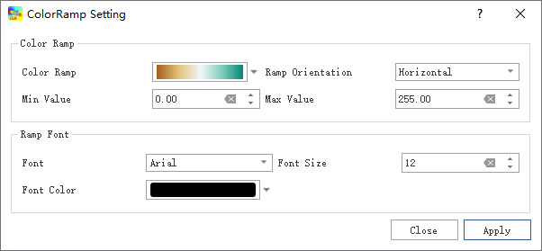
    
参数说明：
      * Color Ramp（色带）用于选择当前使用的色带，在色带下拉列表中，可以选择、新建、修改、保存相应的色带参数
      * Ramp Orientation（色带方向）用于设置色带的方向，可选Horizontal（水平）和Vertical（垂直）两种方式
      * Min Value（最小值）和Max Value（最大值）用于设置色带旁标注的数值范围
      * Font（字体）、Font Size（字号）、Font Color（颜色）用于设置图例中Lev Text（Lev文字标注）的字体字族、字号大小和文字颜色
(3) 根据需要设置完相关参数后，点击“Apply”按钮即可保存并预览设置效果
